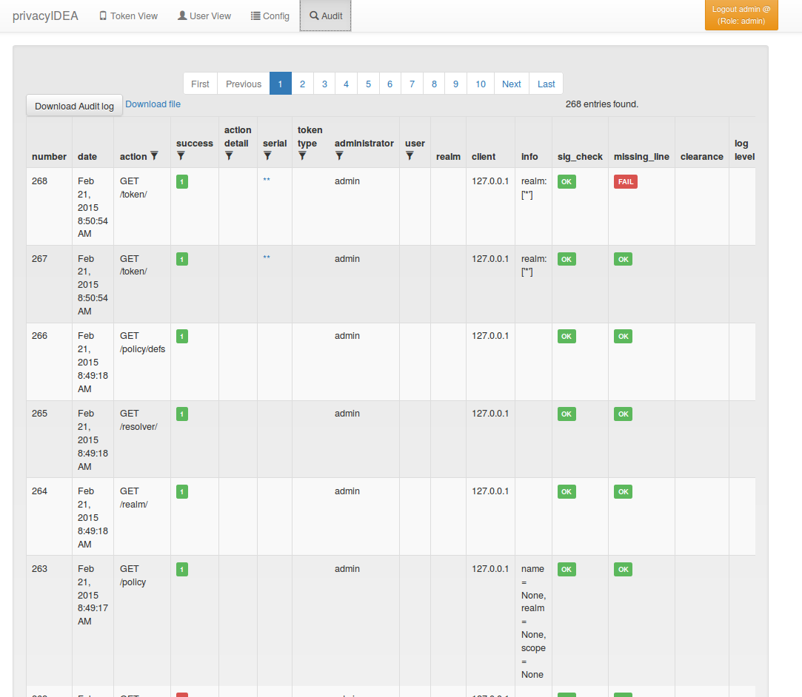

# 10. Audit|审计

The systems provides a sophisticated audit log, that can be viewed in the WebUI.

系统提供了一个复杂的审计日志，可以在Web界面中查看。



Audit Log(审计日志)

privacyIDEA comes with an SQL audit module. (see [Audit log](http://privacyidea.readthedocs.io/en/latest/modules/audit.html#code-audit))

privacyIDEA自带一个SQL审计模块。（请参阅[Audit log](http://privacyidea.readthedocs.io/en/latest/modules/audit.html#code-audit)）

## 10.1. Cleaning up entries|清除条目

The sqlaudit module writes audit entries to an SQL database. For performance reasons the audit module does no log rotation during the logging process.

But you can set up a cron job to clean up old audit entries.

You can specify a highwatermark and a lowwatermark. To clean up the audit log table, you can call pi-manage at command line:

sqlaudit模块将审计条目写入SQL数据库。出于性能原因，审计模块在日志记录过程中不会进行日志更迭。但是您可以设置一个cron作业来清除旧的审计条目。您可以指定高水位和低水位。要清除审计日志表，可以在命令行调用pi-manage：

```
pi-manage rotate_audit --highwatermark 20000 --lowwatermark 18000
```

This will, if there are more than 20000 log entries, clean all old log entries, so that only 18000 log entries remain.

这样，如果有超过20000个日志条目，那么将从最旧的日志条目开始清除，仅保留18000个日志条目。

### 10.1.1. Access rights

访问权限

You may also want to run the cron job with reduced rights. I.e. a user who has no read access to the original pi.cfg file, since this job does not need read access to the SECRET or PEPPER in the pi.cfg file.

您可能还希望以低权限运行cron作业。也就是说，对原始pi.cfg文件没有读取访问权限的用户，因为此作业不需要对pi.cfg文件中的SECRET或PEPPER的读取访问权限。

So you can simply specify a config file with only the content:

所以你可以简单地指定一个配置文件只有以下内容：

```
PI_AUDIT_SQL_URI = <your database uri>
```

Then you can call pi-manage like this:

然后你可以这样调用pi-manage：

```
PRIVACYIDEA_CONFIGFILE=/home/cornelius/src/privacyidea/audit.cfg \
pi-manage rotate_audit
```

This will read the configuration (only the database uri) from the config file audit.cfg.

这将从配置文件audit.cfg中读取配置（只有数据库uri）。

### 10.1.2. Table size

Sometimes the entires to be written to the database may be longer than the column in the database. You can either enlarge the columns in the database or you can set

有时，要写入数据库的条目可能比数据库中的列长。您可以扩展数据库中的列，也可以设置

```
PI_AUDIT_SQL_TRUNCATE = True
```

in pi.cfg. This will truncate each entry to the defined column length.

到pi.cfg。这将截取每个条目到定义的列长度。