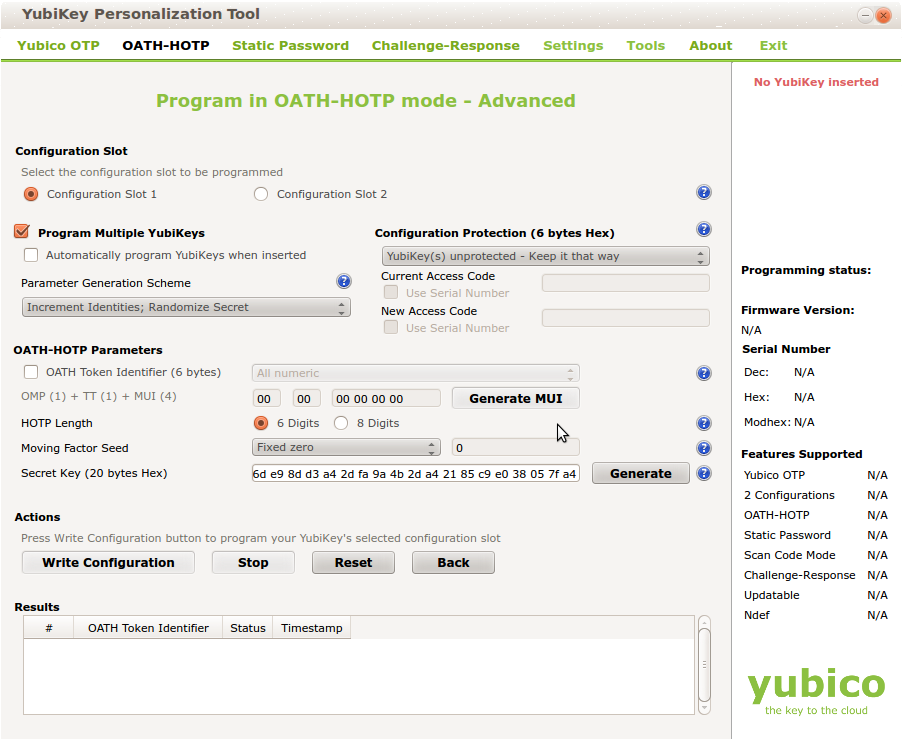

## 12.1. Import|导入

Seed files that contain the secret keys of hardware tokens can be imported to the system via the menu Import.

The default import options are to import SafeNet XML file, OATH CSV files, Yubikey CSV files or PSKC files.

### 12.1.1. GPG Encryption

Starting with privacyIDEA 2.14 you can import GPG encrypted seed files. All files mentioned below can be encrypted this way.

privacyIDEA needs its own GPG key. You may create one like this:

```
mkdir /etc/privacyidea/gpg GNUPGHOME=/etc/privacyidea/gpg gpg –gen-key
```

Then make sure, that the directory /etc/privacyidea/gpg is chown 700 for the user privacyidea.

Now you can export the public key and hand it to your token vendor.

```
GNUPGHOME=/etc/privacyidea/gpg gpg -a –export <keyid>
```

Now the token vendor can send the seed file GPG encrypted. You do not need to decrypt the file and store the decrypted file on a network folder. Just import the GPG encrypted file to privacyIDEA!

> Note:
> 
> Using the key PI_GNUPG_HOME in pi.cfg you can change the default above mentioned GNUPGHOME directory.
> 
> Note:
> 
> privacyIDEA imports an ASCII armored file. If you get a binary file you can easily convert this binary file to an ASCII armored output like this:  
```
gpg –enarmor import.csv.gpg
```

### 12.1.2. OATH CSV

This is a very simple CSV file to import HOTP, TOTP or OATH tokens. You can also convert your seed easily to this file format, to import the tokens.

The file format looks like this:

```
<serial>, <seed>, <type>, <otp length>, <time step>
```

For OCRA tokens it looks like this:

```
<serial>, <seed>, OCRA, <ocra suite>
```

**serial** is the serial number of the token that will also be used to identify the token in the database. Importing the same serial number twice will overwrite the token data.

**seed** is the secret key, that is used to calculate the OTP value. The seed is provided in a hexadecimal notation. Depending on the length either the SHA1 or SHA256 hash algorithm is identified.

**type** is either HOTP, TOTP or OCRA.

**otp length** is the length of the OTP value generated by the token. This is usually 6 or 8.

**time step** is the time step of TOTP tokens. This is usually 30 or 60.

**ocra suite** is the ocra suite of the OCRA token according to <span id="id2">[[1]](#ocra)</span>.

### 12.1.3. Yubikey CSV

Here you can import the CSV file that is written by the Yubikey personalization tool <span id="id3">[[2]](#yubipers)</span>. privacyIDEA can import all Yubikey modes, either Yubico mode or HOTP mode.



> Note:
> 
> There is an annoying drawback of the personalization tool: If you a initializing several HOTP yubikeys it will not write the serial number to the file.

### 12.1.4. PSKC

The Portable Symmetric Key Container is specified in <span id="id4">[[3]](#rfc6030)</span>. OATH compliant token vendors provide the token seeds in a PSKC file. privacyIDEA lets you import PSKC files. All necessary information (OTP length, Hash algorithm, token type) are read from the file.

> [[1]](#id2): http://tools.ietf.org/html/rfc6287#section-6<span id="ocra"></span>
> 
> [[2]](#id3): http://www.yubico.com/products/services-software/personalization-tools/use/<span id="yubipers"></span>
> 
> [[3]](#id4): https://tools.ietf.org/html/rfc6030<span id="rfc6030"></span>