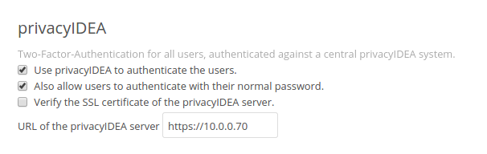

# 13. Application Plugins|应用程序插件

privacyIDEA comes with application plugins. These are plugins for applications like PAM, OTRS, Apache2, FreeRADIUS, ownCloud or simpleSAMLphp which enable these application to authenticate users against privacyIDEA.

privacyIDEA自带了应用程序插件。这些是诸如PAM，OTRS，Apache2，FreeRADIUS，ownCloud或simpleSAMLphp之类的应用程序的插件，它们使这些应用程序能够依靠privacyIDEA对用户进行认证。

You may also write your own application plugin or connect your own application to privacyIDEA. This is quite simple using a REST API Validate endpoints.

您还可以编写自己的应用程序插件或将自己的应用程序连接到privacyIDEA。使用REST API Validate endpoints会很简单地做到这点。

## 13.1. Pluggable Authentication Module

可插拔认证模块

The PAM module of privacyIDEA directly communicates with the privacyIDEA server via the API. The PAM module also supports offline authentication. In this case you need to configure an offline machine application. (See Offline)

privacyIDEA的PAM模块通过API直接与privacyIDEA服务器通信。PAM模块还支持离线验证。在这种情况下，您需要配置离线机器应用程序。（参阅Offline）

You can install the PAM module with a ready made Debian package for Ubuntu or just use the source code file. It is a python module, that requires pam-python.

您可以使用Ubuntu现成的Debian软件包安装PAM模块，或者使用源代码文件。它是一个python模块，需要pam-python。

The configuration could look like this:

配置可能如下所示：

```
... pam_python.so /path/to/privacyidea_pam.py
url=https://localhost prompt=privacyIDEA_Authentication
```

The URL parameter defaults to `https://localhost`. You can also add the parameters `realm=` and `debug`.

URL参数默认为`https://localhost`。您还可以添加`realm=`和`debug`参数。

If you want to disable certificate validation, which you should not do in a productive environment, you can use the parameter `nosslverify`.

如果要禁用证书验证（您不应在生产环境中进行此操作），可以使用参数`nosslverify`。

A new parameter `cacerts=` lets you define a CA Cert-Bundle file, that contains the trusted certificate authorities in PEM format.

新参数`cacerts=`允许您定义CA Cert-Bundle文件，其包含PEM格式的受信任的证书颁发机构。

The default behaviour is to trigger an online authentication request. If the request was successful, the user is logged in. If the request was done with a token defined for offline authentication, then in addition all offline information is passed to the client and cached on the client so that the token can be used to authenticate without the privacyIDEA server available.

默认行为是触发在线认证请求。如果请求成功，则用户登录。如果请求是使用为离线认证定义的令牌完成的，则所有离线信息都将传递到客户端并缓存在客户端上，以便令牌可用于没有可用privacyIDEA服务器时进行认证。

### 13.1.1. try_first_pass

Starting with version 2.8 privacyidea_pam supports try_first_pass. In this case the password that exists in the PAM stack will be sent to privacyIDEA. If this password is successfully validated, than the user is logged in without additional requests. If the password is not validated by privacyIDEA, the user is asked for an additional OTP value.

从2.8版本开始，privacyidea_pam支持try_first_pass。在这种情况下，PAM堆栈中存在的密码将发送到privacyIDEA。如果此密码成功验证，则表示用户在没有其他请求的情况下登录。如果密码没有被privacyIDEA验证，则会要求用户提供其他OTP值。

> Note:
> 
> This can be used in conjunction with the passthru policy. In this case users with no tokens will be able to login with only the password in the PAM stack.
> 
> 注：
> 
> 这可以与passthru策略结合使用。在这种情况下，没有令牌的用户将能够仅使用PAM堆栈中的密码登录。

Read more about how to use PAM to do OTP with OpenVPN.

关于更多如何使用PAM，参阅OTP with OpenVPN。

## 13.2. Using pam_yubico

If you are using yubikey tokens you might also use pam_yubico. You can use Yubikey tokens for two more or less distinct applications. The first is using privacyideas PAM module as described above. In this case privacyidea handles the policies for user access and password validation. This works fine, when you only use privacyidea for token validation.

如果你使用yubikey令牌，你也可以使用pam_yubico。您可以对两个或多个不同的应用程序使用Yubikey令牌。第一个是如上所述使用privacyideas PAM模块。在这种情况下，privacyidea处理用户访问和密码验证的策略。这可以正常工作，当你只使用privacyidea进行令牌验证。

The second mode is using the standard PAM module for yubikeys from Yubico pam_yubico to handle the token validation. The upside ist that you can use the PAM module included with you distribution, but there are downsides as well.

第二种模式是使用来自Yubico pam_yubico的yubikeys的标准PAM模块来处理令牌验证。其优点是，您可以使用随附的PAM模块，但也有缺点。

* You can’t set a token PIN in privacyidea, because pam_yubico tries to use the token PIN entered by the user as a system password (which is likely to fail), i.e. the PIN will be stripped by pam_yubico and will not reach the privacyIDEA system.(您不能在privacyidea中设置令牌PIN，因为pam_yubico尝试使用用户输入的令牌PIN作为系统密码（这可能会失败），即PIN将被pam_yubico删除，并且不会送达privacyIDEA系统)
* Setting the policy which tokens are valid for which users is done either in ~/.yubico/authorized_keys or in the file given by the authfile option in the PAM configuration. The api server will only validate the token, but not check any kind of policy.(在~/.yubico/authorized_keys中或在PAM配置中的authfile选项给出的文件中设置策略哪些令牌对哪些用户有效。api服务器将只验证令牌，但不检查任何类型的策略)

You can work around the restrictions by using a clever combination of tokentype yubikey and yubico as follows:

您可以通过使用tokentype yubikey和yubico的巧妙组合解决这些限制，如下所示：

* enroll a yubikey token with `yubikey_mass_enroll --mode YUBICO`.(使用`yubikey_mass_enroll --mode YUBICO`注册yubikey令牌)
* do not set a token password.(不要设置令牌密码)
* do not assign the token to a user.(不要将令牌分配给用户)
* please make a note of yubikey.prefix (12 characters starting with vv).(请记下yubikey.prefix（以vv开头的12个字符）)

Now the token can be used with pam_yubico, but will not allow any user access in privacyidea. If you want to use the token with pam_yubico see the manual page for details. You’ll want something like the following in your PAM config:

```
auth required pam_yubico.so id=<apiid> key=<API key> \
     urllist=https://<privacyidea-server>/ttype/yubikey authfile=/etc/yubikeys/authorized_yubikeys
```

The file /etc/yubikeys/authorized_yubikeys contains a line for each user with the username and the allowed tokens delimited by ”:”, for example:

```
<username>:<serial number1>:<prefix1>:<prefix2>
```

... doc/configuration/tokenconfig, add yubikey.rst to describe how to configure Client ID/apiid and API key

Now create a second token representing the Yubikey, but this time use the Yubico Cloud mode. Go to Tokens -> Enroll Token and select Yubico Cloud mode. Enter the 12 characters prefix you noted above and assign this token to a user and possibly set a token PIN. It would be nice to have the the serial number of the UBCM token correspond to the UBAM token, but this is right now not possible with the WebUI.

In the WebUI, test the UBAM token without a Token PIN, test the UBCM token with the stored Token PIN, and check the token info afterwards. Check the yubikey token via /ttype/yubikey, for example with:

ykclient –debug –url https://<privacyidea>/ttype/yubikey –apikey “<API key>” “apiid” <otp>

There should be successful authentications (count_auth_success), but no failures.

## 13.3. FreeRADIUS Plugin

If you want to install the FreeRADIUS Plugin on Ubuntu 14.04 LTS this can be easily done, since there is a ready made package (see FreeRADIUS).

If you want to run your FreeRADIUS server on another distribution, you may download the module at <span id="id1">[[1]](#rlmperl)</span>.

Then you need to configure your FreeRADIUS site and the perl module. The latest FreeRADIUS plugin uses the /validate/check REST API of privacyIDEA.

You need to configure the perl module in FreeRADIUS modules/perl to look something like this:

```
perl {
    module = /usr/share/privacyidea/freeradius/privacyidea_radius.pm
}
```

Your freeradius enabled site config should contain something like this:

```
authenticate {
     Auth-Type Perl {
        perl
     }
     digest
     unix
}
```

While you define the default authenticate type to be Perl in the users file:

```
DEFAULT Auth-Type := Perl
```

> Note:
> 
> The privacyIDEA module uses other perl modules that were not thread safe in the past. So in case you are using old perl dependencies and are experiencing thread problems, please start FreeRADIUS with the -t switch. (Everything works fine with Ubuntu 14.04 and Debian 7.)

You can test the RADIUS setup using a command like this:

```
echo "User-Name=user, Password=password" | radclient -sx yourRadiusServer \
   auth topsecret
```

> Note:
> 
> Do not forget to configure the clients.conf accordingly.

Read more about Radius and Realms or RADIUS plugin configuration.

## 13.4. Microsoft NPS server

You can also use the Microsoft Network Protection Server with privacyIDEA. A full featured integration guide can be found at the NetKnights webpage <span id="id6">[[6]](#nps)</span>.

## 13.5. simpleSAMLphp Plugin

You can install the plugin for simpleSAMLphp on Ubuntu 14.04 LTS (see SimpleSAMLphp) or on any other distribution using the source files from <span id="id2">[[2]](#simplesaml)</span>.

Follow the simpleSAMLphp instructions to configure your authsources.php. A usual configuration will look like this:

```
'example-privacyidea' => array(
    'privacyidea:privacyidea',

    /*
     * The name of the privacyidea server and the protocol
     * A port can be added by a colon
     * Required.
     */
    'privacyideaserver' => 'https://your.server.com',

    /*
     * Check if the hostname matches the name in the certificate
     * Optional.
     */
    'sslverifyhost' => False,

    /*
     * Check if the certificate is valid, signed by a trusted CA
     * Optional.
     */
    'sslverifypeer' => False,

    /*
     * The realm where the user is located in.
     * Optional.
     */
    'realm' => '',

    /*
     * This is the translation from privacyIDEA attribute names to
     * SAML attribute names.
     */
     'attributemap' => array('username' => 'samlLoginName',
                             'surname' => 'surName',
                             'givenname' => 'givenName',
                             'email' => 'emailAddress',
                             'phone' => 'telePhone',
                             'mobile' => 'mobilePhone',
                             ),
),
```

## 13.6. TYPO3

You can install the privacyIDEA extension from the TYPO3 Extension Repository. The privacyIDEA extension is easily configured.

**privacyIDEA Server URL**

This is the URL of your privacyIDEA installation. You do not need to add the path validate/check. Thus the URL for a common installation would be https://yourServer/.

**Check certificate**

Whether the validity of the SSL certificate should be checked or not.

> Warning:
> 
> If the SSL certificate is not checked, the authentication

request could be modified and the answer to the request can be modified, easily granting access to an attacker.

**Enable privacyIDEA for backend users**

If checked, a user trying to authenticate at the backend, will need to authenticate against privacyIDEA.

**Enable privacyIDEA for frontend users**

If checked, a user trying to authenticate at the frontend, will need to authenticate against privacyIDEA.

**Pass to other authentication module**

If the authentication at privacyIDEA fails, the credential the user entered will be verified against the next authentication module.

This can come in handy, if you are setting up the system and if you want to avoid locking yourself out.

Anyway, in a productive environment you probably want to uncheck this feature.

## 13.7. OTRS

There are two plugins for OTRS. For OTRS version 4.0 and higher use privacyIDEA-4_0.pm.

This perl module needs to be installed to the directory Kernel/System/Auth.

On Ubuntu 14.04 LTS you can also install the module using the PPA repository and installing:

```
apt-get install privacyidea-otrs
```

To activate the OTP authentication you need to add the following to Kernel/Config.pm:

```
$Self->{'AuthModule'} = 'Kernel::System::Auth::privacyIDEA';
$Self->{'AuthModule::privacyIDEA::URL'} = \
        "https://localhost/validate/check";
$Self->{'AuthModule::privacyIDEA::disableSSLCheck'} = "yes";
```

> Note:
> 
> As mentioned earlier you should only disable the checking of the SSL certificate if you are in a test environment. For productive use you should never disable the SSL certificate checking.
> 
> Note:
> 
> This plugin requires, that you also add the path validate/check to the URL.

## 13.8. Apache2

The Apache plugin uses mod_wsgi and redis to provide a basic authentication on Apache2 side and validating the credentials against privacyIDEA.

On Ubuntu 14.04 LTS you can easily install the module from the PPA repository by issuing:

```
apt-get install privacyidea-apache-client
```

To activate the OTP authentication on a “Location” or “Directory” you need to configure Apache2 like this:

```
<Directory /var/www/html/secretdir>
     AuthType Basic
     AuthName "Protected Area"
     AuthBasicProvider wsgi
     WSGIAuthUserScript /usr/share/pyshared/privacyidea_apache.py
     Require valid-user
</Directory>
```

> Note:
> 
> Basic Authentication sends the base64 encoded password on each request. So the browser will send the same one time password with each reqeust. Thus the authentication module needs to cache the password as the successful authentication. Redis is used for caching the password.
> 
> Warning:
> 
> As redis per default is accessible by every user on the machine, you need to use this plugin with caution! Every user on the machine can access the redis database to read the passwords of the users. The cached credentials are stored as pbkdf2+sha512 hash.

## 13.9. NGINX

The NGINX plugin uses the internal scripting language lua of the NGINX webserver and redis as caching backend to provide basic authentication against privacyIDEA.

On Ubuntu 14.04 LTS or Debian Jessi 8 you can easyly install the module by installing the following packages:

```
nginx-extras lua-nginx-redis lua-cjson redis-server
```

You can retrieve the nginx plugin here: <span id="id5">[[5]](#nginxplugin)</span>

To activate the OTP authentication on a “Location” you need to include the lua script that basically verifies the given credentials against the caching backend. New authentications will be sent to a different (internal) location via subrequest which points to the privacyIDEA authentication backend (via proxy_pass).

For the basic configuration you need to include the following lines to your location block

```
location / {
    # additional plugin configuration goes here # access_by_lua_file
    ‘privacyidea.lua’;
} location /privacyidea-validate-check {
    internal; proxy_pass https://privacyidea/validate/check;
}
```

You can customize the authentication plugin by setting some of the following variables in the secured location block:

```
# redis host:port
# set $privacyidea_redis_host "127.0.0.1";
set $privacyidea_redis_post 6379;

# how long are accepted authentication allowed to be cached
# if expired, the user has to reauthenticate
set $privacyidea_ttl 900;

# privacyIDEA realm. leave empty == default
set $privacyidea_realm 'somerealm'; # (optional)

# pointer to the internal validation proxy pass
set $privacyidea_uri "/privacyidea-validate-check";

# the http realm presented to the user
set $privacyidea_http_realm "Secure zone (use PIN + OTP)";
```

> Note:
> 
> Basic Authentication sends the base64 encoded password on each request. So the browser will send the same one time password with each reqeust. Thus the authentication module needs to cache the password as the successful authentication. Redis is used for caching the password similar to the Apache2 plugin.
> 
> Warning:
> 
> As redis per default is accessible by every user on the machine, you need to use this plugin with caution! Every user on the machine can access the redis database to read the passwords of the users. The cached credentials are stored as SHA1_HMAC hash. If you prefer a stronger hashing method feel free to extend the given password_hash/verify functions using additional lua libraries (for example by using lua-resty-string).

## 13.10. ownCloud

The ownCloud plugin is a ownCloud user backend. The directory user_privacyidea needs to be copied to your owncloud apps directory.



Activating the ownCloud plugin

You can then activate the privacyIDEA ownCloud plugin by checking Use privacyIDEA to authenticate the users. All users now need to be known to privacyIDEA and need to authenticate using the second factor enrolled in privacyIDEA - be it an OTP token, Google Authenticator or SMS/Smartphone.

Checking Also allow users to authenticate with their normal passwords. lets the user choose if he wants to authenticate with the OTP token or with his original password from the original user backend.

> Note:
> 
> At the moment using a desktop client with a static password is not supported.

## 13.11. OpenVPN

Read more about how to use OpenVPN with privacyidea at OTP with OpenVPN.

## 13.12. Further plugins

You can find further plugins for Dokuwiki, Wordpress, Contao and Django at <span id="id4">[[4]](#cornelinuxgithub)</span>.

> [[1]](#id1): https://github.com/privacyidea/privacyidea/tree/master/authmodules/FreeRADIUS<span id="rlmperl"></span>
> 
> [[2]](#id2): https://github.com/privacyidea/simplesamlphp-module-privacyidea<span id="simplesaml"></span>
> 
> [3]: https://github.com/privacyidea/privacyidea/tree/master/authmodules
> 
> [[4]](#id4): https://github.com/cornelinux?tab=repositories<span id="cornelinuxgithub"></span>
> 
> [[5]](#id5): https://github.com/dhoffend/lua-nginx-privacyidea<span id="nginxplugin"></span>
> 
> [[6]](#id6): https://netknights.it/en/nps-2012-for-two-factor-authentication-with-privacyidea/<span id="nps"></span>