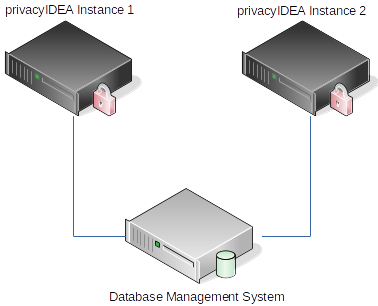
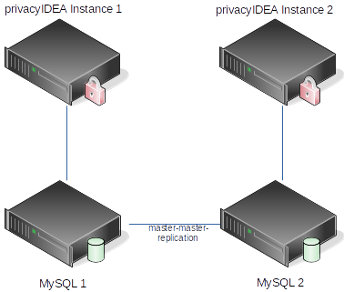

## 15.7. How can I setup HA (High Availability) with privacyIDEA?|privacyIDEA如何设置HA（高可用性）？

privacyIDEA does not track any state internally. All information is kept in the database. Thus you can configure several privacyIDEA instances against one DBMS(Database Management System) and have the DBMS do the high availability.

privacyIDEA不会在内部跟踪任何状态。所有信息保存在数据库中。因此，您可以使用一个DBMS（Database Management System）配置多个privacyIDEA实例，并让DBMS执行高可用性。

> Note:
> 
> The passwords and OTP key material in the database is encrypted using the encKey. Thus it is possible to put the database onto a DBMS that is controlled by another database administrator in another department.
> 
> 注：
> 
> 数据库中的密码和OTP密钥使用encKey进行加密。因此，可以将数据库放置在由其他部门的数据库管理员控制的DBMS上。

### 15.7.1. HA setups

HA设置

When running HA you need to assure to configure the pi.cfg file on all privacyIDEA instances accordingly. You might need to adapt the SQLALCHEMY_DATABASE_URI accordingly.

当运行HA时，您需要确保相应地在所有privacyIDEA实例上配置pi.cfg文件。您可能需要相应地调整SQLALCHEMY_DATABASE_URI。

Be sure to set the same SECRET_KEY and PI_PEPPER on all instances.

请务必在所有实例上设置相同的SECRET_KEY和PI_PEPPER。

Then you need to provide the same encryption key (file encKey) and the same audit signing keys on all instances.

然后，您需要在所有实例上提供相同的加密密钥（文件encKey）和相同的审计签名密钥。

#### 15.7.1.1. Using one central DBMS

使用一个中央DBMS

If you already have a high available, redundant DBMS - like MariaDB Galera Cluster - which might even be addressable via one cluster IP address the configuration is fairly simple. In such a case you can configure the same SQLALCHEMY_DATABASE_URI on all instances.

如果你已经有一个高可用的冗余DBMS，如MariaDB Galera集群，甚至可以通过一个集群IP地址寻址，配置相当简单。在这种情况下，您可以在所有实例上配置相同的SQLALCHEMY_DATABASE_URI。

#### 15.7.1.2. Using MySQL master-master-replication

使用MySQL master-master-replication

If you have no DBMS or might want to use a dedicated database server for privacyIDEA, you can setup one MySQL server per privacyIDEA instance and configure the MySQL servers to run in a master-master-replication.

如果没有DBMS或想要privacyIDEA使用专用的数据库服务器，您可以为每个privacyIDEA实例设置一个MySQL服务器，并配置MySQL服务器在master-master-replication中运行。

> Note:
> 
> The master-master-replication only works with two MySQL
servers.
> 
> 注：
> 
> master-master-replication仅适用于两个MySQL
服务器。

There are some good howtos out there like [[1]](#mastermasterhowto).

这里 [[1]](#mastermasterhowto)有一些好的教程。

Footnotes

> [[1]](#id1):
> 
> <https://www.digitalocean.com/community/tutorials/how-to-set-up-mysql-master-master-replication>