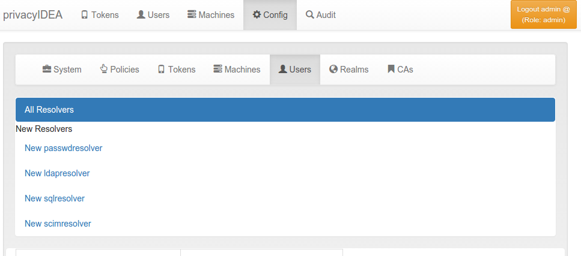
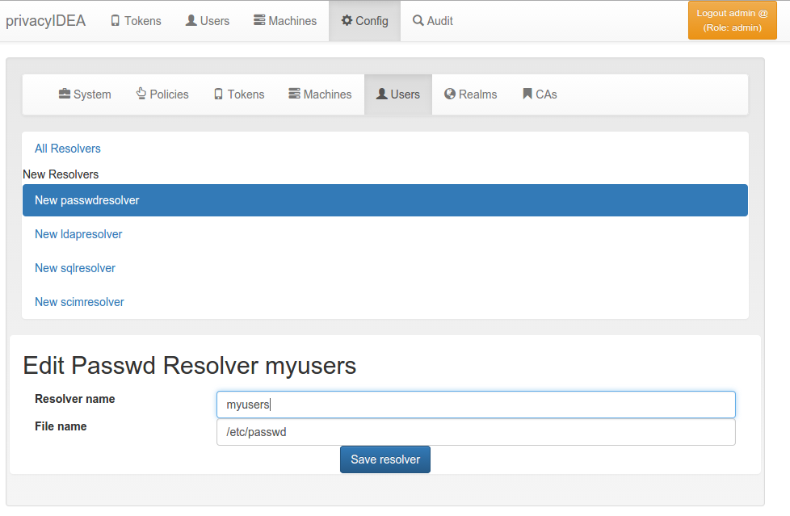
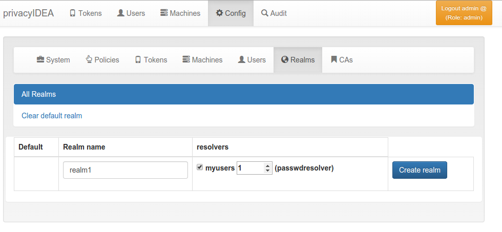
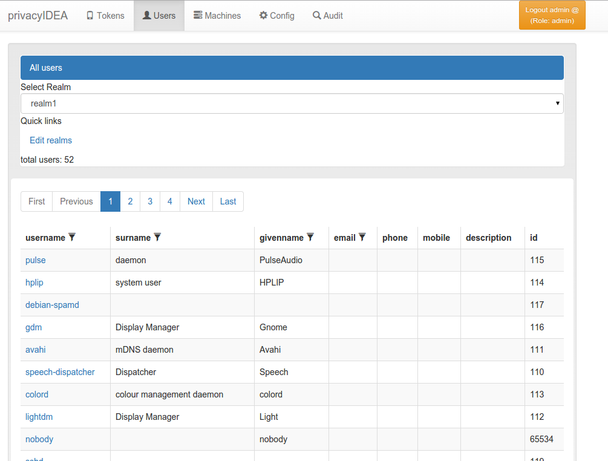

## 3.2. Creating your first realm|创建第一个域

> Note:
> 
> When the administrator logs in and no useridresolver and no realm is defined, a popup appears, which asks you to create a default realm. During these first steps you may say “No”, to get a better understanding.
> 
> 注：
> 
> 当管理员登录且没有已定义的用户ID解析器和域时，会弹出一个窗口，要求您创建一个默认域。在这里，你可以选“No”，以获得更好的理解。

Users in privacyIDEA are read from existing sources. See Realms for more information.

In these first steps we will simply read the users from your /etc/passwd file.

privacyIDEA中的用户是从现有来源读取的。有关详细信息，请参阅Realms。这里我们先简单地从/etc/passwd文件中读取用户。

### 3.2.1 Create a UserIdResolver

创建用户ID解析器

The UserIdResolver is the connector to the user source. For more information see UserIdResolvers.

用户ID解析器是用户源的连接器。有关详细信息，请参阅UserIdResolvers。

* Go to Config -> Users to create a UserIdResolver.(点击Config -> Users)

  

  Create the first UserIdResolver(创建第一个用户ID解析器)
  
* Choose New passwdresolver and(点击New passwdresolver)
* Enter the name “myusers”.(在Resolver name内输入“myusers”)
* Save it.(点击Save resolver保存)

  

  Create the first UserIdResolver(创建第一个用户ID解析器)

You just created your first connection to a user source.

您刚刚创建了与用户源的第一个连接。

### 3.2.2. Create a Realm

创建域

User sources are grouped together to a so called “realm”. For more information see Realms.

用户源在一起被组合成所谓的“域”。有关详细信息，请参阅Realms。

* Go to Config -> Realms(点击Config -> Realms)
* Enter “realm1” as the new realm name and select the priority 1.(输入“realm1”作为新的域名称，并选择优先级1)
* Check the resolver “myusers” to be included into this realm.(检查解析器“myusers”包含在此域中的)
* Save it.(点击Create realm保存)

  

  Create the first Realm(创建第一个域)

* Go to Users and you will see the users from the /etc/passwd.(点击Users，可以看到来自/etc/passwd的用户)

  The users from /etc/passwd(来自/etc/passwd的用户)

**Congratulation!**You created your first realm.

You are now ready to enroll a token to a user. Read Enrolling your first token.

祝贺您！您已经创建了第一个域。现在可以向用户注册令牌。阅读Enrolling your first token。