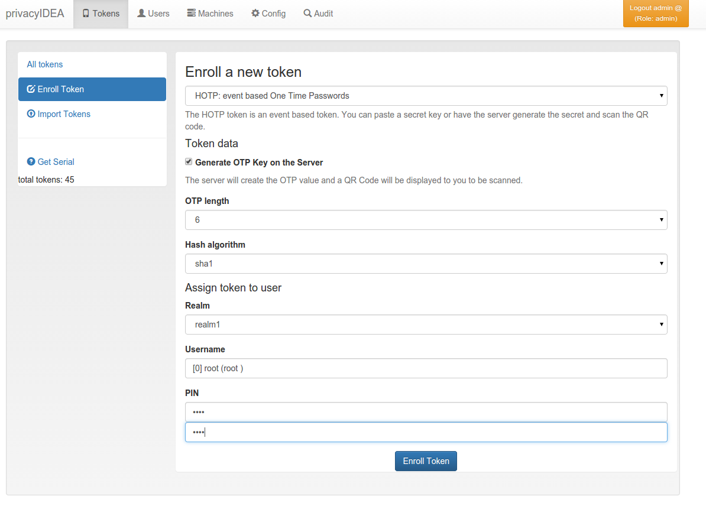
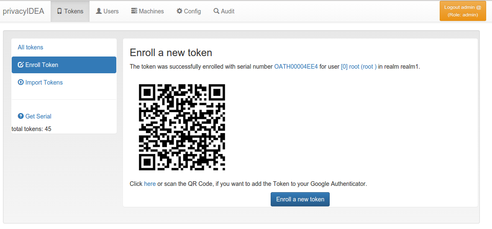
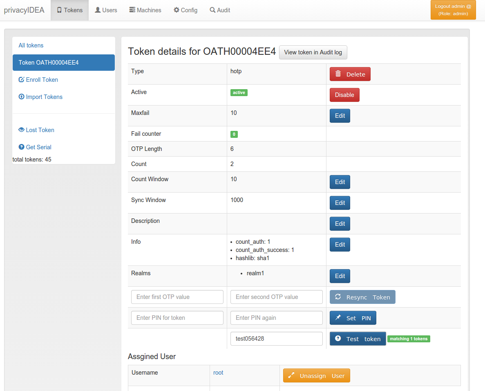

## 3.3. Enrolling your first token|注册第一个令牌

You may now enroll a new token. In this example we are using the Google Authenticator App, that you need to install on your smartphone.

您现在可以注册新的令牌。在此示例中，我们使用的是Google身份验证器应用，您需要在智能手机上先安装。

* Go to Tokens -> Enroll Token(点击Tokens -> Enroll Token)

  

  The Token Enrollment Dialog(令牌注册对话框)

* Select the username root. When you start typing “r”, “o”... the system will find the user root automatically.(选择用户“root”。当你输入“r”，“o”...系统会自动找到用户root)
* Enter a PIN. I entered “test”.(输入一个PIN,这里输入“test”)
* and click “Enroll Token”.(点击“Enroll Token”)

  

  Enrollment Success(注册成功)

* After enrolling the token you will see a QR code, that you need to scan with the Google Authenticator App.(注册令牌后，您会看到一个QR码，使用Google身份验证器扫描)
* Click on the serial number link at the top of the dialog.(单击对话框顶部的序列号链接)

  

  Test the Token(测试令牌)

* Now you see the token details.(现在可以看到令牌的详细信息)
* Left to the button “Test Token” you can enter the PIN and the OTP value generated by the Google Authenticator.(在“Test Token”按钮左边，您可以输入注册令牌时输入的PIN再加上由Google身份验证器生成的和OTP值)
* Click the button “Test Token”. You should see a green “matching 1 tokens”.(单击按钮“Test Token”。您应该会看到一个绿色的“matching 1 tokens”)

**Congratulations!**You just enrolled your first token to a user.

Now you are ready to attach applications to privacyIDEA in order to add two factor authentication to those applications. To attach applications read the chapter Application Plugins.

You may also go on reading the chapter Configuration to get a deeper insight in the configuration possibilities.

恭喜您！您刚刚向用户注册了第一个令牌。现在，您可以将应用程序附加到privacyIDEA，以便为这些应用程序添加双因素身份验证。要附加应用程序，请阅读Application Plugins章节。您还可以阅读Configuration章节，以深入了解配置的可能性。