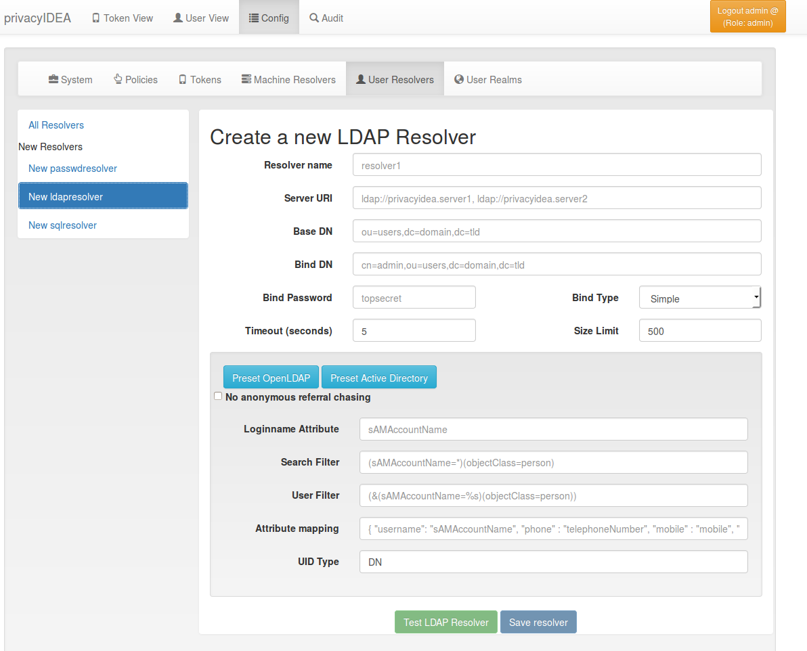
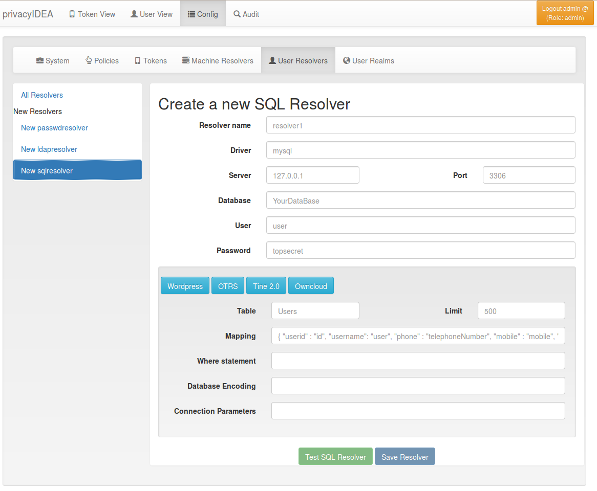

## 4.1. UserIdResolvers|用户ID解析器

Each organisation or company usually has its users managed at a central location. This is why privacyIDEA does not provide its own user management but rather connects to existing user stores.

每个组织或公司通常有其用户管理中心。这就是为什么privacyIDEA不提供自己的用户管理，而是连接到现有的用户源。

UserIdResolvers are connectors to those user stores, the locations, where the users are managed. Nowadays this can be LDAP directories or especially Active Directory, some times FreeIPA or the Redhat 389 service. But classically users are also located in files like /etc/passwd on standalone unix systems. Web services often use SQL databases as user store.

Today with many more online cloud services SCIM is also an uprising protocol to access userstores.

用户ID解析器是这些用户源的连接器。这些用户源可以是LDAP，Active Directory，FreeIPA或Redhat 389服务。但是经典用户也位于独立的UNIX系统上/etc/passwd文件中。Web服务通常使用SQL数据库作为用户源。今天越来越多使用的在线云服务SCIM也是一种访问用户源的协议。

privacyIDEA already comes with UserIdResolvers to talk to all these user stores:

privacyIDEA已经附带用户ID解析器来与所有这些用户源交互：

* Flatfile resolver,(平面文件解析器)
* LDAP resolver,(LDAP解析器)
* SQL resolver,(SQL解析器)
* SCIM resolver.(SCIM解析器)

> Note:
> 
> New resolver types (python modules) can be added easily. See the module section for this (UserIdResolvers).
> 
> 注：
> 
> 可以很容易地添加新的解析器类型（python模块）。请参阅module章节（UserIdResolvers）。

You can create as many UserIdResolvers as you wish and edit existing resolvers. When you have added all configuration data, most UIs of the UserIdResolvers have a button “Test resolver”, so that you can test your configuration before saving it.

您可以创建任意数量的用户ID解析器，并编辑现有的解析器。添加所有配置数据后，用户ID解析器的大多数界面都有一个“Test resolver”按钮，以便您可以在保存配置之前对其进行测试。

Starting with privacyIDEA 2.4 resolvers can be editable, i.e. you can edit the users in the user store. Read more about this at Manage Users.

从privacyIDEA 2.4开始可以编辑解析器，即您可以编辑用户源中的用户。有关详情，请参阅Manage Users。

> Note:
> 
> Using the policy authentication:otppin=userstore users can authenticate with the password from their user store, being the LDAP password, SQL password or password from flat file.
> 
> 注：
> 
> 使用认证策略：`otppin=userstore`，用户可以使用用户源中的密码进行认证，如LDAP密码，SQL密码或来自平面文件的密码。

### 4.1.1. Flatfile resolver

平面文件解析器

Flatfile resolvers read files like /etc/passwd.

平面文件解析器从文件中读取信息，如/etc/passwd等。

> Note:
> 
> The file /etc/passwd does not contain the unix password. Thus, if you create a flatfile resolver from this file the functionality with otppin=userstore is not available. You can create a flatfile with passwords using the tool privacyidea-create-pwidresolver-user.
> 
> 注：
> 
> /etc/passwd文件不包含unix密码。因此，如果从此文件创建平面文件解析器，则`otppin=userstore`的功能不可用。您可以使用工具`privacyidea-create-pwidresolver-user`创建带有密码的平面文件。

Create a flat file like this:

像这样创建一个平面文件：

```
privacyidea-create-pwidresolver-user -u user2 -i 1002 >> /your/flat/file
```

### 4.1.2. LDAP resolver

LDAP解析器

The LDAP resolver can be used to access any kind of LDAP service like OpenLDAP, Active Directory, FreeIPA, Penrose, Novell eDirectory.

LDAP解析器可用于访问任何类型的LDAP服务，如OpenLDAP，Active Directory，FreeIPA，Penrose，Novell eDirectory。



LDAP resolver configuration(LDAP解析器配置)

In case of Active Directory connections you might need to check the box No anonymous referral chasing. The underlying LDAP library is only able to do anonymous referral chasing. Active Directory will produce an error in this case <span id="id1">[[1]](#adreferrals)</span>.

在A连接ctive Directory的情况下，您可能需要选中“No anonymous referral chasing”。底层LDAP库只能执行anonymous referral chasing。在这种情况下Active Directory将产生一个错误 [[1]](#adreferrals)。

The Server URI can contain a comma separated list of servers. The servers are used to create a server pool and are used with a round robin strategy <span id="id3">[[3]](#serverpool)</span>.

Example:

服务器地址可以是包含逗号分隔的服务器列表。服务器用于创建服务器池，并使用轮询调度 [[3]](#serverpool)。如：

```
ldap://server1, ldaps://server2:1636, server3, ldaps://server4
```

This will create LDAP requests to

这将请求创建LDAP：

* server1 on port 389
* server2 on port 1636 using SSL
* server3 on port 389
* server4 on port 636 using SSL.

The Bind Type with Active Directory can either be chosen as “Simple” or as “NTLM”.

Active Directory的Bind Type可以选择“Simple”或“NTLM”。

> Note:
> 
> When using bind type “Simple” you need to specify the Bind DN like cn=administrator,cn=users,dc=domain,dc=name. When using bind type “NTLM” you need to specify Bind DN like DOMAINNAME\username.
> 
> 注：
> 
> 当Bind Type选择“Simple”时，您需要指定Bind DN为`cn=administrator,cn=users,dc=domain,dc=name`这种格式。当Bind Type选择“NTLM”时，您需要指定Bind DN为`DOMAINNAME\username`这种格式。

The LoginName attribute is the attribute that holds the loginname. It can be changed to your needs.

Loginname Attribute是保存登录名的属性。它可以改变为您需要的。

The searchfilter and the userfilter are used for forward and backward search the object in LDAP.

The searchfilter is used to list all possible users, that can be used in this resolver.

The userfilter is used to find the LDAP object for a given loginname. This is why the userfilter contains the python string replacement parameter %s, which will be filled with the given loginname to find the LDAP object.

Search Filter和User Filter用于向前和向后搜索LDAP中的对象。Search Filter用于列出在此解析器中所有可用的用户。User Filter用于查找给定登录名的LDAP对象。这就是为什么User Filter包含python字符串替换参数`%s`，它将填充给定的登录名来查找LDAP对象。

The attribute mapping maps LDAP object attributes to user attributes in privacyIDEA. privacyIDEA knows the following attributes:

Attribute mapping将LDAP对象属性映射到privacyIDEA中的用户属性。 privacyIDEA已知的属性有：

* username (mandatory),
* phone,
* mobile,
* email,
* surname,
* givenname,
* password
* accountExpires.

The above attributes are used for privacyIDEA’s normal functionality and are listed in the userview. However, with a SAML authentication request user attributes can be returned. (see SAML Attributes). To return arbitrary attributes from the LDAP you can add additional keys to the attribute mapping with a key, you make up and the LDAP attribute like:

上述属性用于privacyIDEA的正常功能，并在用户视图中列出。但是，使用SAML认证请求，可以返回用户属性。（请参阅SAML Attributes）。要从LDAP返回任意属性，您可以添加映射其他关键字，然后组合LDAP属性，如：

```
"homedir": "homeDirectory", "studentID": "objectGUID"
```

“homeDirectory” and “objectGUID” being the attributes in the LDAP directory and “homedir” and “studentID” the keys returned in a SAML authentication request.

“homeDirectory”和“objectGUID”是LDAP中的属性，“homedir”和“studentID”是SAML身份验证请求中返回的关键字。

The UID Type is the unique identifier for the LDAP object. If it is left blank, the distinguished name will be used. In case of OpenLDAP this can be entryUUID and in case of Active Directory objectGUID.

UID类型是LDAP对象的唯一标识符。如果将其留空，将使用可分辨名称。在OpenLDAP中，可能是entryUUID，而在Active Directory中是objectGUID。

> Note:
> 
> The attributes entryUUID and objectGUID are case sensitive!
> 
> 注：
> 
> 属性entryUUID和objectGUID是区分大小写的！

#### 4.1.2.1. Modifying users

修改用户

Starting with privacyIDEA 2.12 you can define the LDAP resolver as editable. I.e. you can create and modify users from within privacyIDEA.

There are two additional configuration parameters for this case.

从privacyIDEA 2.12开始，您可以将LDAP解析器定义为可编辑。即您可以在privacyIDEA创建和修改用户。这种情况下有两个附加配置参数。

DN Template defines how the DN of the new LDAP object should be created. You can use username, surname, givenname and basedn to create the distiguished name.

Examples:

DN Template定义了如何创建新的LDAP对象的DN。您可以使用username，surname，givenname和basedn来创建可分辨名称。如：

```
CN=<givenname> <surname>,<basedn>

CN=<username>,OU=external users,<basedn>

uid=<username>,ou=users,o=example,c=com
```

Object Classes defines which object classes the user should be assigned to. This is a comma separated list. The usual object classes for Active Directory are

Object Classes定义了应该将用户分配给哪些对象类。这是一个逗号分隔的列表。 Active Directory的常见对象类有：

```
top, person, organizationalPerson, user, inetOrgPerson
```

#### 4.1.2.2. Expired Users

过期用户

You may set

```
"accountExpires": "accountExpires"
```

in the attribute mapping for Microsoft Active Directories. You can then call the user listing API with the parameter accountExpires=1 and you will only see expired accounts.

This functionality is used with the script privacyidea-expired-users.

你可以在微软Active Directories的属性映射中设置`"accountExpires": "accountExpires"`。然后使用参数`accountExpires=1`调用用户列表API，就可以只查看过期的帐户。此功能与`privacyidea-expired-users`脚本一起使用。

### 4.1.3. SQL resolver

SQL解析器

The SQL resolver can be used to retrieve users from any kind of SQL database like MySQL, PostgreSQL, Oracle, DB2 or sqlite.

SQL解析器可用于从任何类型的SQL数据库检索用户，如MySQL，PostgreSQL，Oracle，DB2或sqlite。



SQL resolver configuration(SQL解析器配置)

In the upper frame you need to configure the SQL connection. The SQL resolver uses SQLAlchemy internally. In the field Driver you need to set a driver name as defined by the SQLAlchemy dialects like “mysql” or “postgres”.

在上图页面中，需要配置SQL连接。SQL解析器使用内置SQLAlchemy。在Driver字段中，您需要设置一个SQLAlchemy dialects定义的驱动程序名称，如“mysql”或“postgres”。

In the SQL attributes frame you can specify how the users are identified.

The Database table contains the users.

在SQL attributes框架中，您可以指定如何标识用户。Database table包含用户。

> Note:
> 
> At the moment only one table is supported, i.e. if some of the user data like email address or telephone number is located in a second table, those data can not be retrieved.
> 
> 注：
> 
> 目前仅支持一个表，即：比如电子邮件地址或电话号码等一些用户数据位于第二表中，则不能检索这些数据。

The Limit is the SQL limit for a userlist request. This can be important if you have several thousand user entries in the table.

Limit是用户列表请求的SQL限制。如果表中有几千个用户条目，这可能很重要。

The Attribute mapping defines which table column should be mapped to which privayIDEA attribute. The known attributes are:

Attribute mapping定义哪个表列应映射到哪个privacyIDEA属性。已知的属性有：

* userid (mandatory),
* username (mandatory),
* phone,
* mobile,
* email,
* givenname,
* surname,
* password.

The password attribute is the database column that contains the user password. This is used, if you are doing user authentication against the SQL database.

password属性是包含用户密码的数据库列。如果您使用SQL数据库进行用户身份验证，则使用此方法。

> Note:
> 
> There is no standard way to store passwords in an SQL database. There are several different ways to do this. privacyIDEA supports the most common ways like Wordpress hashes starting with $P or $S. Secure hashes starting with {SHA} or salted secure hashes starting with {SSHA}, {SSHA256} or {SSHA512}. Password hashes of length 64 are interpreted as OTRS sha256 hashes.
> 
> 注：
> 
> 在SQL数据库中存储密码没有标准的方式。有几种不同的方法来做到这一点。 privacyIDEA支持最常见的方式，如{SHA}，{SSHA}，{SSHA256}，{SSHA512}等。

You can add an additional Where statement if you do not want to use all users from the table.

如果不想使用表中的所有用户，则可以添加Where statement。

The poolSize and poolTimeout determine the pooling behaviour. The poolSize (default 5) determine how many connections are kept open in the pool. The poolTimeout (default 10) specifies how long the application waits to get a connection from the pool.

Pool size和Pool timeout确定池的行为。Pool size（默认为5）确定在池中保持打开多少连接。Pool timeout（默认为10）指定应用程序从池获取连接的等待时间。

> Note:
> 
> The Additional connection parameters refer to the SQLAlchemy connection but are not used at the moment.
> 
> 注：
> 
> 附加的Connection Parameters参考SQLAlchemy连接，但目前没有启用。

### 4.1.4. SCIM resolver

SCIM解析器

SCIM is a “System for Cross-domain Identity Management”. SCIM is a REST-based protocol that can be used to ease identity management in the cloud.

SCIM是“System for Cross-domain Identity Management”（跨域身份管理系统）。SCIM是一种REST-based协议，可用于简化云中的身份管理。

The SCIM resolver is tested in basic functions with OSIAM <span id="id2">[[2]](#osiam)</span>, the “Open Source Idenitty & Access Management”.

SCIM解析器使用OSIAM [[2]](#osiam)(“开源身份和访问管理系统”)测试了基本功能。

To connect to a SCIM service you need to provide a URL to an authentication server and a URL to the resource server. The authentication server is used to authenticate the privacyIDEA server. The authentication is based on a client name and the Secret for this client.

Userinformation is then retrieved from the resource server.

The available attributes for the Attribute mapping are:

要连接到SCIM服务，您需要提供到认证服务器的链接和到资源服务器的链接。认证服务器用于认证privacyIDEA服务器。身份验证基于客户端名称和此客户端的密钥。然后从资源服务器检索用户信息。属性映射的可用属性包括：

* username (mandatory),
* givenname,
* surname,
* phone,
* mobile,
* email.

**Footnotes**

> <span id="adreferrals">[[1]](#id1)</span>:
> 
> <http://blogs.technet.com/b/ad/archive/2009/07/06/referral-chasing.aspx>
> 
> <span id="osiam">[[2]](#id2)</span>:
> 
> <http://www.osiam.org>
> 
> <span id="serverpool">[[3]](#id3)</span>:
> 
> <https://github.com/cannatag/ldap3/blob/master/docs/manual/source/servers.rst#server-pool>