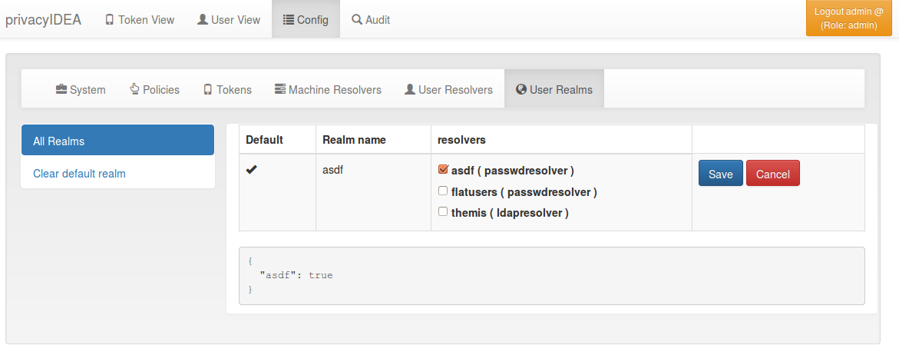
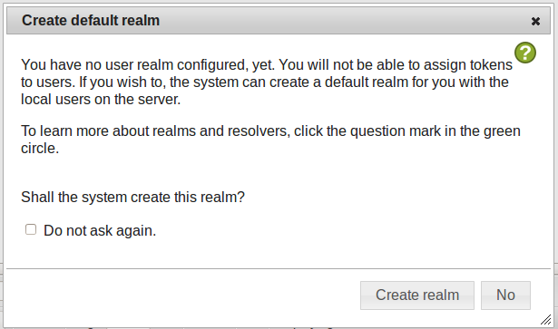

## 4.2. Realms|域

Users need to be in realms to have tokens assigned. A user, who is not member of a realm can not have a token assigned and can not authenticate.

用户需要在域中分配令牌。不属于域的用户不能分配令牌，并且无法进行身份验证。

You can combine several different UserIdResolvers (see UserIdResolvers) into a realm. The system knows one default realm. Users within this default realm can authenticate with their username.

Users in realms, that are not the default realm, need to be additionally identified. Therefor the users need to authenticate with their username and the realm like this:

您可以将几个不同的用户ID解析器（请参阅UserIdResolvers）合并到一个域。系统可识别一个默认域。此默认域中的用户可以直接使用其用户名进行身份验证。不在默认域中的用户，需要使用另外标识。因此，用户需要使用其用户名和域进行身份验证，如下所示：

```
user@realm
```

### 4.2.1. List of Realms

域列表

The realms dialog gives you a list of the already defined realms.

It shows the name of the realms, whether it is the default realm and the names of the resolvers, that are combined to this realm.

You can delete or edit an existing realm or create a new realm.

域对话框提供了已定义域的列表。它显示域的名称，是否是默认域以及包含的解析器的名称。您可以删除或编辑现有域或创建新的域。

### 4.2.2. Edit Realm

编辑域

Each realm has to have a unique name. The name of the realm is case insensitive. If you create a new realm with the same name like an existing realm, the existing realm gets overwritten.

If you click Edit Realm you can select which userresolver should be contained in this realm. A realm can contain several resolvers.

每个域都必须有一个唯一的名称。域的名称不区分大小写。如果创建的域与已有的域名称相同，则现有域将被覆盖。如果点击Edit，您可以选择包含在此域中的用户解析器。一个域可以包含多个解析器。



Edit a realm(编辑域)

### 4.2.3. Resolver Priority

解析器优先级

Within a realm you can give each resolver a priority. The priority is used to find a user that is located in several resolvers. If a user is located in more than one resolver, the user will be taken from the resolver with the lowest number in the priority.

Priorities are numbers between 1 and 999. The lower the number the higher the priority.

Example:

A user “administrator” is located in a resolver “users” which contains all Active Directory users. And the “administrator” is located in a resolver “admins”, which contains all users in the Security Group “Domain Admins” from the very same domain. Both resolvers are in the realm “AD”, “admins” with priority 1 and “users” with priority 2.

Thus the user “administrator@AD” will always resolve to the user located in resolver “admins”.

This is useful to create policies for the security group “Domain Admins”.

在一个域内，可以给每个解析器设置优先级。优先级用于查找位于多个解析器中的用户。如果用户位于多个解析器中，则从优先级编号最低的解析器中读取。优先级是介于1和999之间的数字。数字越小，优先级越高。比如：

用户“administrator”位于包含所有Active Directory用户的解析器“users”中。“administrator”还位于解析器“admins”（包含来自同一域的安全组“Domain Admins”中的所有用户）中。两个解析器都在“AD”域，“admins”的优先级为1，“users”的优先级为2。因此，用户“administrator@AD”将解析到位于解析器“admins”中的用户。这对于为安全组“Domain Admins”创建策略很有用。

> Note:
> 
> A resolver has a priority per realm. I.e. a resolver can have a different priority in each realm.
> 
> 注:
> 
> 解析器在每个域都有优先级。即解析器在每个域可以有不同的优先级。

### 4.2.4. Autocreate Realm

自动创建域



If you have a fresh installation, no resolver and no realm is defined. To get you up and running faster, the system will ask you, if it should create the first realm for you.

If you answer “yes”, it will create a resolver named “deflocal” that contains all users from /etc/passwd and a realm named “defrealm” with this very resolver.

Thus you can immediately start assigning and enrolling tokens.

If you check “Do not ask again” this will be stored in a cookie in your browser.

如果你刚完成全新的安装，没有定义解析器和域。为了让你能更快的运行，系统会询问，是否需要系统为你创建第一个域。如果选择“yes”，它将创建一个名为“deflocal”的解析器，其中包含来自/etc/passwd的所有用户以及一个名为“defrealm”的域。因此，您可以立即开始注册和分配令牌。如果你选中“Do not ask again”（不再询问），这将被存储在浏览器cookie。

> Note:
> 
> The realm “defrealm” will be the default realm. So if you create a new realm manually and want this new realm to be the default realm, you need to set this new realm to be default manually.
> 
> 注：
> 
> 域“defrealm”将是默认域。因此，如果手动创建新的域，并希望此新域成为默认域，则需要将此新域手动设置为默认域。