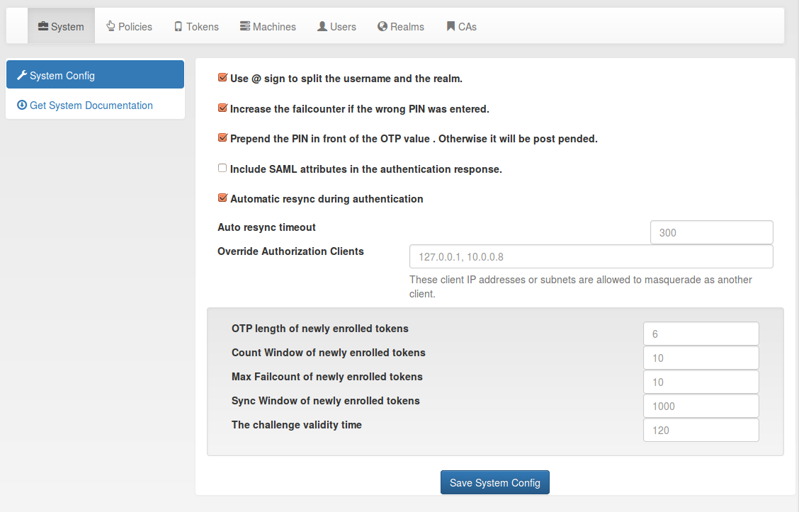

## 4.3. System Config|系统配置

The system configuration has three logical topics: Settings, token default settings and GUI settings.

系统配置有三个逻辑主题：设置，令牌默认设置和图形用户界面设置。



The system config(系统配置)

### 4.3.1. Settings

设置

#### 4.3.1.1. Split @ Sign

分隔符号@

splitAtSign defines if the username like user@company given during authentication should be split into the loginname user and the realm name company. In most cases this is the wanted behaviour.

But given your users log in with email addresses like user@gmail.com and otheruser@outlook.com you probably do not want to split.

splitAtSign定义在认证期间是否需要将登录名和域名称通过@分隔，如用户名user，域名称company，分隔为user@company。在大多数情况下，这是需要的。但是，如果用户使用电子邮件地址（如user@gmail.com或otheruser@outlook.com）登录，您可能不希望拆分。

#### 4.3.1.2. SAML Attributes

SAML属性

Return SAML attributes defines if during an SAML authentication request additional SAML attributes should be returned. Usually an authentication response only returns true or false.

Return SAML attributes定义在SAML身份验证请求期间是否应返回其他SAML属性。通常认证响应只返回true或false。

The SAML attributes are the known attributes that are defined in the attribute mapping e.g. of the LDAP resolver like email, phone, givenname, surname or any other attributes you fetch from the LDAP directory. For more information read LDAP resolver.

SAML属性是在解析器中定义映射的已知属性。例如LDAP解析器中的email，phone，givenname，surname或从LDAP目录中提取的任何其他属性。有关更多信息，请阅读LDAP resolver。

In addition you can set the parameter ReturnSamlAttributesOnFail. In this case the response contains the SAML attributes of the user, even if the user failed to authenticate.

此外，您可以设置参数ReturnSamlAttributesOnFail。在这种情况下，即使用户认证失败，响应也包含用户的SAML属性。

#### 4.3.1.3. FailCounterIncOnFalsePin

PIN失败计数器

If during authentication the given PIN matches a token but the OTP value is wrong the failcounter of the tokens for which the PIN matches, is increased. If the given PIN does not match any token, by default no failcounter is increased. The later behaviour can be adapted by FailCounterIncOnFalsePin. If FailCounterIncOnFalsePin is set and the given OTP PIN does not match any token, the failcounter of all tokens is increased.

如果在认证期间给定PIN匹配令牌，但是OTP值错误，则PIN匹配的令牌的失败计数器值增加。如果给定的PIN不匹配任何令牌，默认情况下不会增加计数器值。可以通过FailCounterIncOnFalsePin来调整。如果设置了FailCounterIncOnFalsePin且给定的OTP PIN不与任何令牌匹配，则增加所有令牌的失败计数器值。

#### 4.3.1.4. Prepend PIN

PIN前置

PrependPin defines if the OTP PIN should be given in front (“pin123456”) or in the back (“12345pin”) of the OTP value.

PrependPin定义OTP PIN应在OTP值的前面（“pin123456”）还是后面（“12345pin”）。

#### 4.3.1.5. AutoResync

自动重新同步

Auto resync defines if the system should try to resync a token if a user provides a wrong OTP value. AutoResync works like this:

* If the counter of a wrong OTP value is within the resync window, the system remembers the counter of the OTP value for this token in the token info field otp1c.
* Now the user needs to authenticate a second time within auto resync timeout with the next successive OTP value.
* The system checks if the counter of the second OTP value is the successive value to otp1c.
* If it is, the token counter is set and the user is successfully authenticated.

Auto resync定义了如果用户提供错误的OTP值，系统是否应该尝试重新同步令牌。自动同步的工作原理如下：

* 如果错误的OTP值的计数器在resync窗口内，则系统在令牌信息otp1c字段中记住该令牌OTP值的计数器。
* 现在，用户需要在auto resync timeout（自动重新同步超时）内第二次使用下一个连续OTP值进行身份验证。
* 系统检查第二次OTP值的计数器是否是otp1c的连续值。
* 如果是，则设置令牌计数器，并且用户被成功认证。

> Note:
> 
> AutoResync works for all HOTP and TOTP based tokens including SMS and Email tokens.
> 
> 注：
> 
> 自动重新同步适用于所有基于HOTP和TOTP的令牌，包括短信和电子邮件令牌。

#### 4.3.1.6. Override Authorization Client


Override Authorization client is important with client specific policies (see Policies) and RADIUS servers or other proxies. In case of RADIUS the authenticating client for the privacyIDEA system will always be the RADIUS server, which issues the authentication request. But you can allow the RADIUS server IP to send another client information (in this case the RADIUS client) so that the policy is evaluated for the RADIUS client. Such a proxy or RADIUS server may add the API parameter client with a new IP address.

This field takes a comma separated list of IP Networks mapping to other IP Networks.

Examples

Override Authorization client对于客户端特定策略（请参阅Policies）和RADIUS服务器或其他代理很重要。在RADIUS的情况下，privacyIDEA系统身份验证的客户端将始终是发出认证请求的RADIUS服务器。但是您可以允许RADIUS服务器IP发送另一个客户端信息（此处为RADIUS的客户端），以便为RADIUS的客户端评估策略。这样代理或RADIUS服务器可以用新的IP地址添加API参数client。此字段采用以逗号分隔映射到其他IP网络的IP网络列表。如：

```
10.1.2.0/24 > 192.168.0.0/16*
```

Proxies in the sub net 10.1.2.0/24 may mask as client IPs 192.168.0.0/16. In this case the policies for the corresponding client in 192.168.x.x apply.

子网10.1.2.0/24中的代理可以伪装成客户端ip地址192.168.0.0/16。在这种情况下，适用在192.168.x.x中对应的客户端策略。

```
172.16.0.1
```

The proxy 172.16.0.1 may mask as any arbitrary client IP.

代理172.16.0.1可以伪装成任意客户端IP。

```
10.0.0.18 > 10.0.0.0/8
```

The proxy 10.0.0.18 may mask as any client in the subnet 10.x.x.x.

代理10.0.0.18可以伪装为子网10.x.x.x中的任意客户端。

### 4.3.2. Token default settings

令牌默认设置

#### 4.3.2.1. Reset Fail Counter

复位失败计数器

DefaultResetFailCount will reset the failcounter of a token if this token was used for a successful authentication. If not checked, the failcounter will not be resetted and must be resetted manually.

DefaultResetFailCount可重置令牌的失败计数器，如果此令牌身份验证成功。如果未选中，失败计数器将不会重置，必须手动重置。

> Note:
> 
> The following settings are token specific value which are set during enrollment. If you want to change this value of a token later on, you need to change this at the tokeninfo dialog.
> 
> 注：
> 
> 以下设置是在令牌注册期间设置的特定值。如果以后要更改令牌的此值，您需要在tokeninfo对话框中更改此值。

#### 4.3.2.2. Maximum Fail Counter

失败计数器最大值

DefaultMaxFailCount is the maximum failcounter a token way get. If the failcounter exceeds this number the token can not be used unless the failcounter is resetted.

DefaultMaxFailCount是令牌失败计数器的最大值。如果失败计数器超过这一值，则重置失败计数器之前令牌不能使用。

> Note:
> 
> In fact the failcounter will only increase till this maxfailcount. Even if more failed authentication request occur, the failcounter will not increase anymore.
> 
> 注：
> 
> 事实上，失败计数器只会增加到这个最大值。即使有更多失败的认证请求，失败计数器的值也不会再增加。

#### 4.3.2.3. Sync Window

同步窗口

DefaultSyncWindow is the window how many OTP values will be calculated during resync of the token.

DefaultSyncWindow是在令牌重新同步期间将计算多少OTP值的窗口。

#### 4.3.2.4. OTP Length

OTP长度

DefaultOtpLen is the length of the OTP value. If no OTP length is specified during enrollment, this value will be used.

DefaultOtpLen是OTP值的长度。如果在令牌注册期间未指定OTP长度，则将使用此值。

#### 4.3.2.5. Count Window

计数窗口

DefaultCountWindow defines how many OTP values will be calculated during an authentication request.

DefaultCountWindow定义在身份验证请求期间计算多少OTP值。

#### 4.3.2.6. Challenge Validity Time

挑战有效时间

DefaultChallengeValidityTime is the timeout for a challenge response authentication. If the response is set after the ChallengeValidityTime, the response is not accepted anymore.

DefaultChallengeValidityTime是挑战响应认证的超时时间。如果响应超过ChallengeValidityTime设置的时间，则不再接受响应。