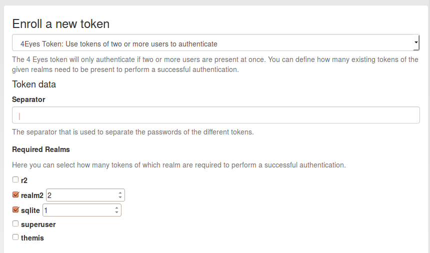

#### 4.4.2.1. Four Eyes

Starting with version 2.6 privacyIDEA supports 4 Eyes Token. This is a meta token, that can be used to define, that two or more token must be used to authenticate. This way, you can set up a “two man rule”.

从2.6版本开始privacyIDEA支持4 Eyes令牌。一种元令牌，可定义两个或更多的令牌同时用于认证。这样，你可以设置“two man rule”。

You can define, from which realm how many unique tokens need to be present, when authenticating:

您可以定义某个域需在认证时需要提交多少个唯一令牌：



Enroll a 4 eyes token(注册4 eyes令牌)

In this example authentication will only be possbile if at least two tokens from realm2 and one token from realm sqlite are present.

在此示例中，仅当来自域realm2的至少两个令牌和来自域sqlite的一个令牌提交时，认证才能通过。

Authentication is done by concatenating the OTP PINs and the OTP values of all tokens. The concatenation is split by the separator character.

It does not matter, in which order the tokens from the realms are entered.

Example

Authentication as:

通过连接所有OTP令牌的PIN和OTP值来完成认证。连接由分隔符分隔。域令牌的输入顺序没有关系。例如，像以下认证：

```
username: "root@r2"
password: "pin123456 secret789434 key098123"
```

The three blocks separated by the blank are checked, if they match tokens in the realms realm2 and sqlite.

The response looks like this in case of success:

检查由空格分隔的三部分，它们是否与域realm2和域sqlite中的令牌匹配。在成功的情况下，响应如下所示：

```
{
  "detail": {
    "message": "matching 1 tokens",
    "serial": "PI4E000219E1",
    "type": "4eyes"
  },
  "id": 1,
  "jsonrpc": "2.0",
  "result": {
    "status": true,
    "value": true
  },
  "version": "privacyIDEA 2.6dev0",
  "versionnumber": "2.6dev0"
}
```

In case of a failed authentication the response looks like this:

在认证失败的情况下，响应如下所示：

```
{
  "detail": {
    "foureyes": "Only found 0 tokens in realm themis",
    "message": "wrong otp value",
    "serial": "PI4E000219E1",
    "type": "4eyes"
  },
  "id": 1,
  "jsonrpc": "2.0",
  "result": {
    "status": true,
    "value": false
  },
  "version": "privacyIDEA 2.6dev0",
  "versionnumber": "2.6dev0"
}
```

> Note:
> 
> The 4Eyes Token verifies that unique tokens from each realm are used. I.e. if you require 2 tokens from a realm, you can not use the same token twice.
> 
> Warning:
> 
> But it does not verify, if these two unique tokens belong to the same user. Thus you should create a poliy, that in such a realm a user may only have on token.
> 
> 注：
> 
> 4Eyes令牌验证使用来自各域的唯一令牌。即如果设置为需要两个来自同一个域的令牌，你不能使用相同的令牌两次。
> 
> 警告：
> 
> 但系统不会验证这两个唯一令牌是否属于同一用户。因此，您可以创建一个策略，只允许一个域内的一个用户有一个令牌（笔者注：原文是“have on token”，但估计是想说“have one token”）。