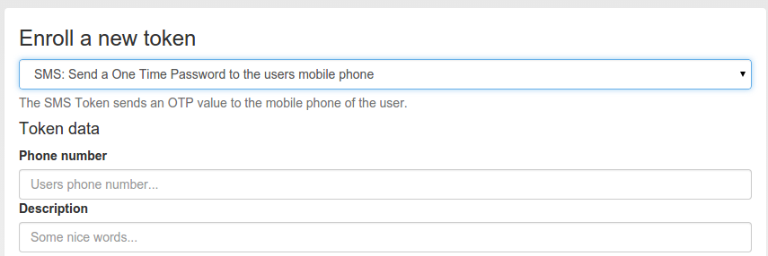

#### 4.4.2.10. SMS

The token type sms sends the OTP value via an SMS service. You can configure the SMS service in SMS OTP Token.

Enroll an SMS token

When enrolling an SMS token, you only need to specify the mobile phone number.

SMS token is a challenge response token. I.e. when sending the OTP PIN in the first authentication request, the sending of the SMS will be triggered and in a second authentication request the OTP value from the SMS needs to be presented.

For a more detailed insight see the code documentation SMS Token.