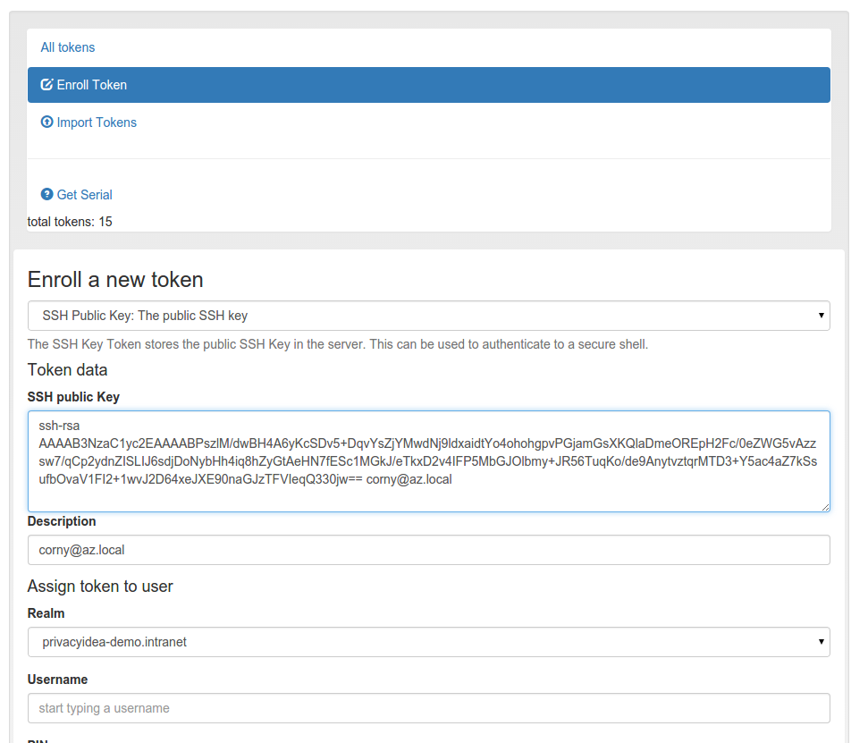

#### 4.4.2.12 SSH Keys

The token type sshkey is the public SSH key, that you can upload and assign to a user. The SSH key is only used for the application type SSH in conjunction with the Client machines concept.

A user or the administrator can upload the public SSH key and assign to a user.

Enroll an SSH key token

Paste the SSH key into the text area. The comment in the SSH key will be used as token comment. You can assign the SSH key to a user and then use the SSH key in Application Definitions SSH.

> Note:
> 
> This way you can manage SSH keys centrally, as you do not need to distribute the SSH keys to all machines. You rather store the SSH keys centrally in privacyIDEA and use **privacyidea-authorizedkeys** to fetch the keys in real time during the login process.