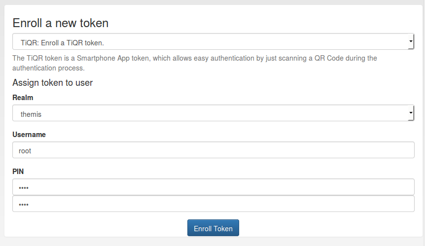
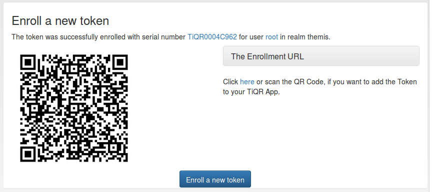

#### 4.4.2.13. TiQR

Starting with version 2.6 privacyIDEA supports the TiQR token. The TiQR token is a smartphone token, that can be used to login by only scanning a QR code.

The token is also enrolled by scanning a QR code.

从2.6版本开始，privacyIDEA支持TiQR令牌。TiQR令牌是智能手机令牌，可以用于通过仅扫描QR码进行登录。令牌也通过扫描QR码进行注册。

Choose a user for the TiQR token(为TiQR令牌选择一个用户)

You can only enroll a TiQR token, when a user is selected.

当一个用户被选择时，您只可以注册TiQR一个令牌。

> Note:
> 
> You can not enroll a TiQR token without assign the token to a user.
> 
> 注：
> 
> 如果不分配令牌给用户，则无法注册TiQR令牌

For more technical information about the TiQR token please see [TiQR Token](http://privacyidea.readthedocs.io/en/latest/modules/lib/tokentypes/tiqr.html#code-tiqr-token).

有关TiQR令牌的更多技术信息，请参阅[TiQR Token](http://privacyidea.readthedocs.io/en/latest/modules/lib/tokentypes/tiqr.html#code-tiqr-token)。