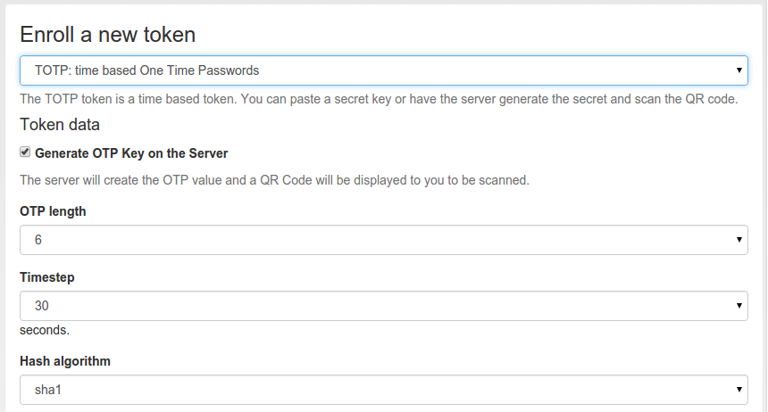

#### 4.4.2.14. TOTP

The TOTP token is - together with the HOTP - the most common token. The TOTP Algorithm is defined in RFC6238. The TOTP token is a time based token. Roughly speaking the TOTP algorithm is the same algorithm like the HOTP, where the event based counter is replaced by the unix timestamp.

The TOTP algorithm has some parameter, like if the generated OTP value will be 6 digits or 8 digits or if the SHA1 oder the SHA256 hashing algorithm is used and the timestep being 30 or 60 seconds.

TOTP令牌与HOTP令牌是最常见的令牌。TOTP算法在RFC 6238中定义。TOTP令牌是基于时间的令牌。粗略地说，TOTP算法是与HOTP相同的算法，其中基于事件的计数器由unix时间戳替代。TOTP算法有一些参数，如生成的OTP值是6位还是8位，使用SHA1还是SHA256散列算法，时间步长为30还是60秒。

##### 4.4.2.14.1. Hardware tokens

硬件令牌

The information about preseeded token and seedable tokens is the same as described in the section about HOTP.

The only available seedable pushbutton TOTP token is the SafeNet eToken Pass. The Yubikey can be used as a TOTP token, but only in conjunction with a smartphone app, since the yubikey has not its own clock.

关于预种令牌和可种令牌的信息与关于HOTP章节中描述的相同。唯一可用的可种按钮TOTP令牌是SafeNet eToken Pass。Yubikey可以用作TOTP令牌，但只能与智能手机应用程序结合使用，因为yubikey没有自己的时钟。

##### 4.4.2.14.2. Software tokens

软件令牌

###### 4.4.2.14.2.1. Experiences

经验

The Google Authenticator and the FreeOTP token can be enrolled easily in TOTP mode using the QR-Code enrollment Feature.

The Google Authenticator is available for iOS, Android and Blackberry devices.

Google身份验证器（适用于iOS，Android和Blackberry设备）和FreeOTP可以使用QR码注册功能轻松注册到TOTP令牌。

笔者注：同HOTP原因，Google身份验证器不太适于在Android上使用，推荐FreeOTP。

##### 4.4.2.14.3. Enrollment

令牌注册

Default settings for TOTP tokens can be configured at TOTP Token Config.

The enrollment is the same as described in HOTP. However, when enrolling TOTP token, you can specify some additional parameters.

可以在TOTP Token Config中配置TOTP令牌的默认设置。令牌注册与HOTP中描述的相同。但是，在注册TOTP令牌时，您可以指定一些其他参数。

Enroll an TOTP token(注册TOTP令牌)