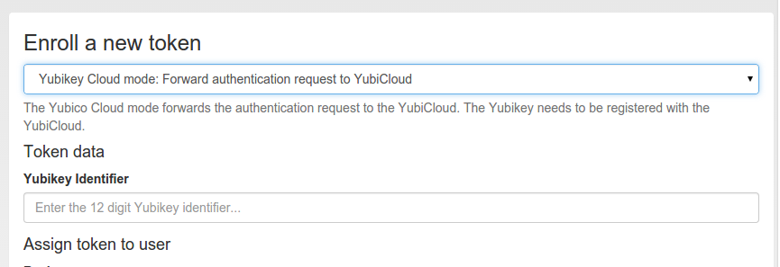

#### 4.4.2.16. Yubico

The token type yubico authenticates against the Yubico Cloud mode. You need to configure this at Yubico Cloud mode.

yubico类型令牌使用Yubico Cloud模式进行身份验证。您需要在Yubico Cloud mode配置此项。

Enroll a Yubico token(注册Yubico令牌)

The token is enrolled by simply saving the Yubikey token ID in the token object. You can either enter the 12 digit ID or you can simply press the Yubikey button in the input field, which will also assign the token.

通过在令牌对象中保存Yubikey令牌ID来注册令牌。您可以输入12位数字ID，也可以输入按Yubikey按钮生成的数字，这也将分配令牌。