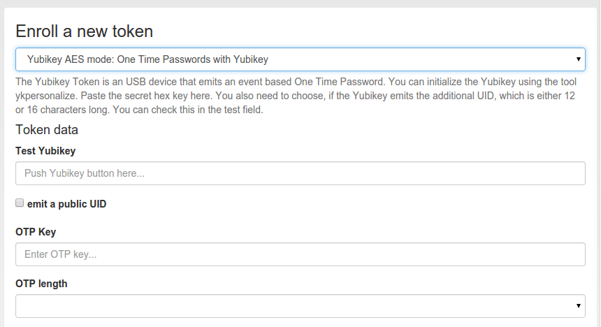

#### 4.4.2.17. Yubikey

The Yubikey is initialized with privacyIDEA and works in Yubicos own AES mode. It outputs a 44 character OTP value, consisting of a 12 character prefix and a 32 character OTP. But in contrast to the Yubico Cloud mode, in this mode the secret key is contained within the token and your own privacyIDEA installation.

If you have the time and care about privacy, you should prefer the Yubikey AES mode over the Yubico Cloud mode.

There are three possible ways to enroll a Yubikey token.

Yubikey用privacyIDEA初始化，并工作在Yubicos自己的AES模式下。它输出一个44字符的OTP值，由12个前缀字符和32个OTP字符组成。但是与Yubico Cloud mode相反，在这种模式下，密钥包含在令牌和您自己安装的privacyIDEA中。如果你有时间且关心隐私，你应该优先选择Yubikey AES mode而非Yubico Cloud mode。有三种可行的方式来注册Yubikey令牌。

> Note:
> 
> We recommend that you use the privacyidea command line client, to initialize the Yubikeys. You can use the mass enrollment, which eases the process of initializing a whole bunch of tokens.
> 
> 注：
> 
> 我们建议您使用privacyidea命令行客户端来初始化Yubikeys。您可以使用批量注册，这使初始化一大堆令牌的过程变得容易。

Run the command like this:

运行如下命令︰

```
privacyidea -U https://your.privacyidea.server -a admin token \
yubikey_mass_enroll --yubimode YUBICO
```

This command initializes the token and stores the AES secret and prefix in privacyidea, so the token is immediatly useful. You can choose the slot with --yubislot. For further help call privcyidea yubikey_mass_enroll with the --help option.

此命令初始化令牌并将前缀和AES密钥存储在privacyidea中，因此令牌立即可用。您可以通过`--yubislot`选择插槽。要获得更多帮助，请在`privcyidea yubikey_mass_enroll`命令使用`--help`选项。

The second way to enroll a yubikey token is also using yubikey_mass_enroll, but with the option --filename to write to token configuration into the specified file. The resulting file can then be imported into privacyidea: Select Tokens -> Import Tokens, select “OATH CSV” and the file you just created.

第二种注册yubikey令牌的方式也是使用`yubikey_mass_enroll`，但要使用`--filename`选项将令牌配置写入指定的文件。然后可以将生成的文件导入privacyidea（Web界面）︰Tokens -> Import Tokens，选择“OATH CSV”并选择刚才创建的文件。

Third and last you can use this dialog to enroll a Yubikey AES mode token, if you have initialized the yubikey with the external ykpersonalize tool.

第三种方式，如果您已使用外部ykpersonalize工具初始化了yubikey，您可以使用此对话框注册Yubikey AES mode令牌。



Enroll a Yubikey AES mode token(注册Yubikey AES mode令牌)

##### 4.4.2.17.1. Redirect api url to privacyideas /ttype/yubikey

重定向api url到privacyideas /ttype/yubikey

Yubico servers use /wsapi/2.0/verify as the path in the validation URL. Some tools (e.g. Kolab 2fa) let the user/admin change the api host, but not the rest of the URL. Let’s redirect the api URL to privacyideas /ttype/yubikey - you’ll need to enable the following two lines in /etc/apache2/site-enabled/privacyidea.conf:

Yubico服务器使用/wsapi/2.0/verify作为验证链接的路径。一些工具（例如Kolab 2fa）让用户或管理员更改api主机，但不更改链接的其余部分。将api URL重定向到privacyideas /ttype/yubikey，您需要在/etc/apache2/site-enabled/privacyidea.conf中启用以下两行（笔者注：原文中只有一行）：

```
RewriteEngine on RewriteRule "^/wsapi/2.0/verify" "/ttype/yubikey" [PT]
```

If you use nginx there is a similar line provided as a comment to the nginx configuration as well.

如果你使用nginx，有类似的一行作为注释提以供nginx配置。