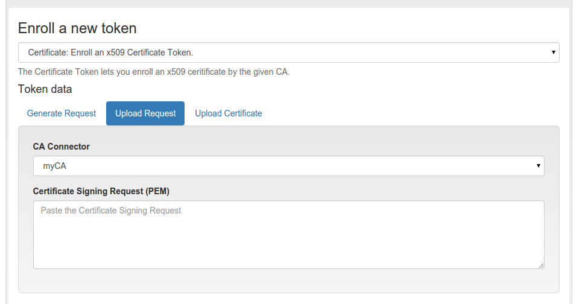
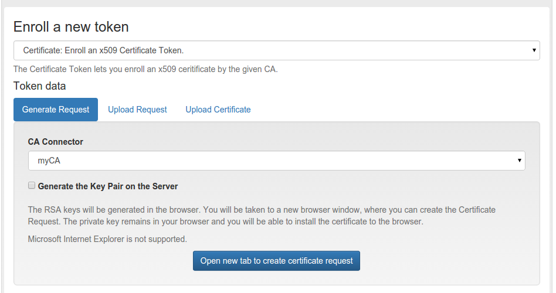
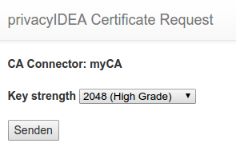

#### 4.4.2.2. Certificates

Starting with version 2.3 privacyIDEA supports certificates. A user can

从2.3版本开始，privacyIDEA支持证书。用户可以：

* upload a certificate request,(上传证书请求)
* upload a certificate or(上传证书)
* he can generate a certificate request in the browser.(在浏览器中生成证书请求)

privacyIDEA does not sign certificate requests itself but connects to existing certificate authorities. To do so, you need to define CA Connectors.

privacyIDEA本身不签署证书请求，需连接到现有的证书颁发机构。因此，您需要定义CA Connectors。

Certificates are attached to the user just like normal tokens. One token of type certificate always contains only one certificate.

证书像正常令牌一样附加到用户。一个证书类型令牌始终只包含一个证书。

If you have defined a CA connector you can upload a certificate signing request (CSR) via the Token Enroll Dialog in the WebUI.

如果已定义CA接口，则可以通过Web界面中的令牌注册对话框上传证书签名请求（CSR）。

Upload a certificate signing request(上传证书签名请求)

You need to choose the CA connector. The certificate will be signed by the CA accordingly. Just like all other tokens the certificate token can be attached to a user.

您需要选择CA接口。证书将由CA相应地签名。与所有其他令牌一样，证书令牌可以附加给用户。

##### 4.4.2.2.1. Generating Signing Requests

生成签名请求

You can also generate the signing request directly in your browser.

您也可以直接在浏览器中生成签名请求。

> Note:
> 
> This uses the keygen HTML-tag that is not supported by the Internet Explorer!
> 
> 注：
> 
> 使用的是HTML-tag注册机，IE浏览器不支持！

Generate a certificate signing request(生成证书签名请求)

When generating the certificate signing request this way the RSA keypair is generated on the client side in the browser.

The certificate is signed by the CA connected by the chosen CA connector.

当以这种方式生成证书签名请求时，在浏览器的客户端生成RSA密钥对。

Download or install the client certificate(下载或安装客户端证书)

Afterwards the user can install the certificate into the browser.

然后，用户可以将证书安装到浏览器中。

> Note:
> 
> By requiring OTP authentication for the users to login to the WebUI (see login_mode) you can have two factor authentication required for the user to be allowed to enroll a certificate.
> 
> 注：
> 
> 通过要求用户OTP认证登录到Web界面（请参阅login_mode），您可以使用双因素身份验证来允许用户注册证书。