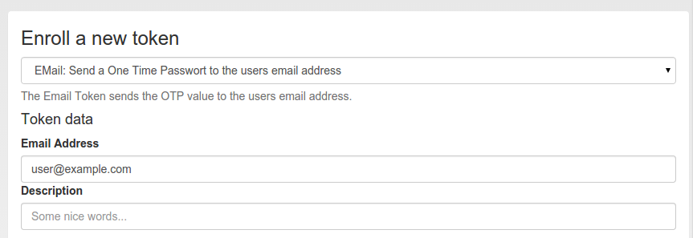

#### 4.4.2.3. EMail

The token type email sends the OTP value in an EMail to the user. You can configure the EMail server in Email OTP Token.

Enroll an EMail token

When enrolling an EMail token, you only need to specify the email address of the user.

The EMail token is a challenge response token. I.e. when using the OTP PIN in the first authentication request, the sending of the EMail will be triggered and in a second authentication request the OTP value from the EMail needs to be presented.

For a more detailed insight see the code documentation Email Token.