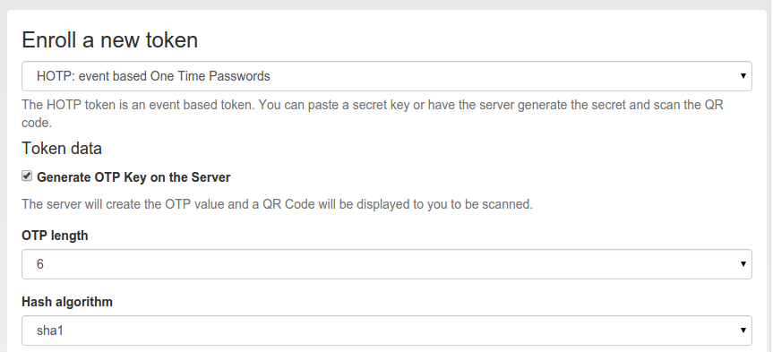
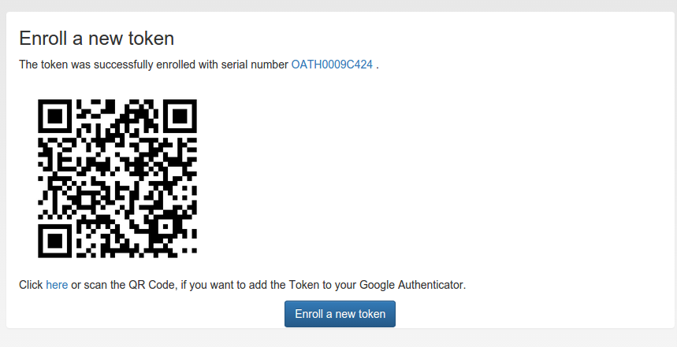

#### 4.4.2.4. HOTP

The HOTP token is - together with the TOTP - the most common token. The HOTP Algorithm is defined in RFC4225. The HOTP token is an event base token. The HOTP algorithm has some parameter, like if the generated OTP value will be 6 digits or 8 digits or if the SHA1 oder the SHA256 hashing algorithm is used.

HOTP令牌与TOTP令牌是最常见的令牌。HOTP算法在RFC 4225中定义。HOTP令牌是基于事件的令牌。HOTP算法有一些参数，如生成的OTP值是6位还是8位，使用SHA1还是SHA256哈希算法。

##### 4.4.2.4.1. Hardware tokens

硬件令牌

There are many token vendors out there who are using the official algorithm to build and sell hardware tokens. You can get HOTP based hardware tokens in different form factors, as a normal key fob for your key ring or as a display card for your purse.

有许多令牌供应商使用官方算法来构建和销售硬件令牌。您可以得到不同形状的HOTP硬件令牌，可作为钥匙圈上的普通钥匙扣或作为您钱包里的显示卡。

###### 4.4.2.4.1.1. Preseeded or Seedable

预种或可种

Usually the hardware tokens like keyfobs or display cards contain a secret key that was generated and implanted at the vendors factory. The vender ships the tokens and a seed file.

通常硬件令牌（如钥匙扣或显示卡）包含供应商出厂生成和植入的秘密密钥。供应商发送令牌和种子文件。

> Warning:
> 
> In this case privacyIDEA can not guarantee that the secret seed of the token is unique and if you are using a real strong factor.
> 
> 警告：
> 
> 在这种情况下，如果您使用真正强因素，privacyIDEA不能保证令牌的密钥种子是唯一的。

privacyIDEA also supports the following seedable HOTP tokens:

privacyIDEA还支持以下可种OTP令牌：

* SafeNet eToken NG OTP
* SafeNet eToken Pass
* Yubikey in OATH mode
* Daplug

Those tokens can be initialized by privacyIDEA. Thus you can be sure, that only you are in possession of the secret seed.

这些令牌可以通过privacyIDEA初始化。因此，你可以确定只有你拥有密钥种子。

###### 4.4.2.4.1.2. Experiences

经验

The above mentioned hardware tokens are known to play well with privacyIDEA. In theory all OATH/HOTP tokens should work well with privacyIDEA. However, there are good experiences with Smartdisplayer OTP cards [[1]](#smartdisplayer) and Feitian C200 [[2]](#feitian) tokens.

上述硬件令牌在privacyIDEA中运行良好。理论上，所有OATH/HOTP令牌都应该配合privacyIDEA正常使用。无论如何，Smartdisplayer OTP cards [1]和Feitian C200 [2]令牌有更好的体验。

##### 4.4.2.4.2. Software tokens

软件令牌

Besides the hardware tokens there are also software tokens, implemented as Apps for your smartphone. These software tokens allow are seedable, so there is no vendor, knowing the secret seed of your OTP tokens.

But software tokens are software after all on device prone to security issues.

除了硬件令牌，还有软件令牌，以智能手机应用程序的形式实现。这些软件令牌是允许可种的，所以没有供应商知道你OTP令牌的密钥种子。但毕竟软件令牌是在设备上的软件，更容易出现安全问题。

###### 4.4.2.4.2.1. Experiences

经验

The Google Authenticator can be enrolled easily in HOTP mode using the QR-Code enrollment Feature.

The Google Authenticator is available for iOS, Android and Blackberry devices.

Google身份验证器（适用于iOS，Android和Blackberry设备）可以使用QR码注册功能轻松注册到HOTP令牌。

笔者注：由于前面提到过的原因，Google身份验证器不太适于在Android上使用，可考虑FreeOTP（新版本支持HOTP）。

##### 4.4.2.4.3. Enrollment

令牌注册

Default settings for HOTP tokens can be configured at HOTP Token Config.

可以在HOTP Token Config中配置HOTP令牌的默认设置。

Enroll an HOTP token(注册HOTP令牌)

During enrollment you can choose, if the server should generate the key or if you have a key, that you can enter into the enrollment page.

As mentioned earlier, you can also choose the OTP length and the hash algoriothm.

在令牌注册期间，您可以选择，服务器是否生成密钥或您有一个密钥可以在注册页面输入。如前所述，您还可以选择OTP长度和哈希算法。

If the server generated the secret seed, you can scan the QR-Code(如果服务器生成了密钥种子，您可以扫描QR码)

After enrolling the token, the QR-Code, containing the secret seed, is displayed, so that you can scan this with your smartphone and import it to your app.

令牌注册后，将显示包含密钥种子的QR码，以便您可以使用智能手机扫描此信息，并将其导入到您的应用程序。

> [[1]](#id1):
> 
> <https://netknights.it/en/produkte/smartdisplayer/>
> 
> [[2]](#id2):
> 
> <https://netknights.it/en/produkte/oath-hotptotp/>