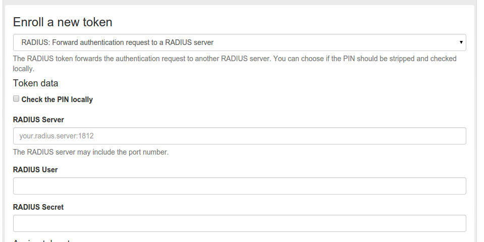

#### 4.4.2.7. RADIUS

The token type RADIUS forwards the authentication request to a RADIUS Server.

When forwarding the authentication request, you can change the username and mangle the password.

RADIUS类型令牌将认证请求转发到RADIUS服务器。转发认证请求时，您可以更改用户名和修改密码。

Enroll a RADIUS token(注册RADIUS令牌)

**Check the PIN locally**

If checked, the PIN of the token will be checked on the local server. If the PIN matches only the remaining part of the issued password will be sent to the RADIUS server.

如果选中，将在本地服务器上检查令牌的PIN。如果PIN匹配，则只有密码的剩余部分被发送到RADIUS服务器。

**RADIUS Server**

The RADIUS server, to which the authentication request will be forwarded. You can specify the port like my.radius.server:1812.

选择将认证请求转发到的RADIUS服务器。您可以指定端口如`my.radius.server:1812`。

**RADIUS User**

When forwarding the request to the RADIUS server, the authentication request will be issued for this user. If the user is left empty, the RADIUS request will be sent with the same user.

当将请求转发到RADIUS服务器时，将为此用户发出认证请求。如果用户为空，则RADIUS请求将使用同一用户发送。

**RADIUS Secret**

The RADIUS secret for this RADIUS client.

为此RADIUS客户端的RADIUS密钥。

> Note:
> 
> Using the RADIUS token you can design migration scenarios. When migrating from other (proprietary) OTP solutions, you can enroll a RADIUS token for the users. The RADIUS token points to the RADIUS server of the old solution. Thus the user can authenticate against privacyIDEA with the old, proprietary token, till he is enrolled a new token in privacyIDEA. The interesting thing is, that you also get the authentication request with the proprietary token in the audit log of privacyIDEA. This way you can have a scenario, where users are still using old tokens and other users are already using new (privacyIDEA) tokens. You will see all authentication requests in the pricacyIDEA system.
> 
> 注：
> 
> 使用RADIUS令牌，您可以设计迁移场景。从其他（专有）OTP解决方案迁移时，您可以为用户注册RADIUS令牌。RADIUS令牌指向旧解决方案的RADIUS服务器。因此，用户可以通过旧的专有令牌来使用privacyIDEA进行认证，直到他在privacyIDEA中注册新的令牌。有趣的是，您还可以在privacyIDEA的审计日志中获取具有专有令牌的身份验证请求。这样，您可以有这样一个场景：有的用户仍在使用旧令牌，而其他用户已在使用新的（privacyIDEA）令牌。您可以在pricacyIDEA系统中看到所有认证请求。