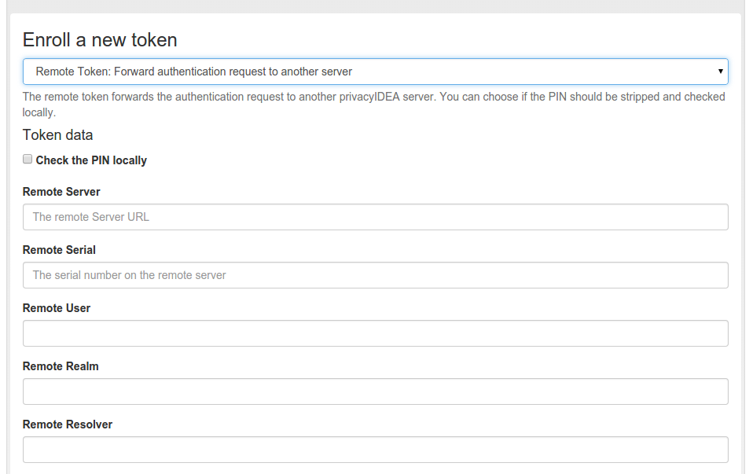

#### 4.4.2.9. Remote

The token type remote forwards the authentication request to another privacyIDEA Server.

When forwarding the authentication request, you can

Remote类型令牌将认证请求转发到另一个privacyIDEA服务器。转发认证请求时，可以：

* change the username(更改用户名)
* change the resolver(更改解析器)
* change the realm(更改域)
* change the serial number(更改序列号)

and mangle the password.

并修改密码。

Enroll a Remote token(注册Remote令牌)

**Check the PIN locally**

If checked, the PIN of the token will be checked on the local server. If the PIN matches only the remaining part of the issued password will be sent to the remote privacyIDEA server.

如果选中，将在本地服务器上检查令牌的PIN。如果PIN匹配，则只有密码的剩余部分被发送到远程privacyIDEA服务器。

**Remote Server**

The privacyIDEA server, to which the authentication request will be forwarded. The path /validate/check will be added automatically. So a sensible input would be https://my.other.server/.

将认证请求转发到的privacyIDEA服务器。将自动添加路径/validate/check。所以合理的输入是`https://my.other.server/`。

**Remote Serial**

If the Remote Serial is specified the given password will be checked against the serial number on the remote privacyIDEA server. Usernames will be ignored.

如果指定了Remote Serial，将根据远程privacyIDEA服务器上的序列号检查给定的密码。用户名将被忽略。

**Remote User**

When forwarding the request to the remote server, the authentication request will be issued for this user.

当将请求转发到远程服务器时，将为此用户发出认证请求。

**Remote Realm**

When forwarding the request to the remote server, the authentication request will be issued for this realm.

当将请求转发到远程服务器时，将为此域发出认证请求。

**Remote Resolver**

When forwarding the request to the remote server, the authentication request will be issued for this resolver.

当将请求转发到远程服务器时，将为此解析器发出认证请求。

> Note:
> 
> You can use Remote Serial to forward the request to a central privacyIDEA server, that only knows tokens but has no knowledge of users. Or you can use Remote Serial to forward the request to an existing to on localhost thus adding a second user to the same token.
> 
> 注：
> 
> 您可以使用Remote Serial将请求转发到中央privacyIDEA服务器，该服务器只知道令牌，但不知道用户。或者，您可以使用Remote Serial将请求转发到现有的本地主机上，从而添加第二个用户到同一个令牌。