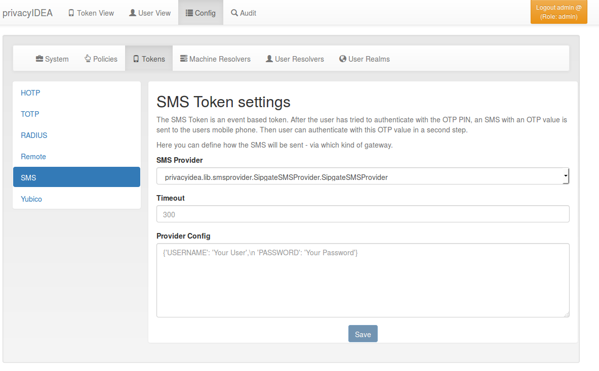

### 4.4.3. Token configuration|令牌配置

Each token type can provide its own configuration dialog.

In this configuration dialog you can define default values for these token types.

每个令牌类型都可以提供自己的配置对话框。在配置对话框中，您可以定义这些令牌类型的默认值。

Token Configuration: SMS(令牌配置：SMS)

* [4.4.3.1. Email OTP Token](4.4.3.1. Email OTP Token.html)
* [4.4.3.2. HOTP Token Config](4.4.3.2. HOTP Token Config.html)
* [4.4.3.3. SMS OTP Token](4.4.3.3. SMS OTP Token.html)
* [4.4.3.4. TiQR Token Config](4.4.3.4. TiQR Token Config.html)
* [4.4.3.5. TOTP Token Config](4.4.3.5. TOTP Token Config.html)
* [4.4.3.6. U2F Token Config](4.4.3.6. U2F Token Config.html)
* [4.4.3.7. Yubico Cloud mode](4.4.3.7. Yubico Cloud mode.html)
* [4.4.3.8. Yubikey AES mode](4.4.3.7. Yubico Cloud mode.html)
