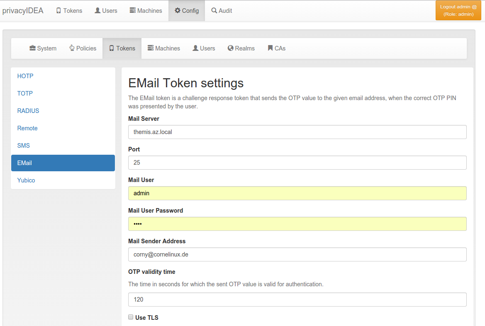

#### 4.4.3.1. Email OTP Token

Email Token configuration(Email令牌配置)

The Email OTP token creates a OTP value and sends this OTP value to the email address of the uses. The Email can be triggered by authenticating with only the OTP PIN:

Email OTP令牌生成一个OTP值，并将此值发送到用户的Email地址。电子邮件可以由OTP PIN认证时触发：

##### 4.4.3.1.1. First step

第一步

In the first step the user will enter his OTP PIN and the sending of the Email is triggered. The user is denied the access.

首先，用户输入他的OTP PIN，并触发电子邮件的发送。用户被拒绝访问。

##### 4.4.3.1.2. Seconds step

第二步

In the second step the user authenticates with the OTP PIN and the OTP value he received via Email. The user is granted access.

Alternatively the user can authenticate with the transaction_id that was sent to him in the response during the first step and only the OTP value. The transaction_id assures that the user already presented the first factor (OTP PIN) successfully.

然后，用户使用OTP PIN和通过电子邮件接收的OTP值进行认证。用户被授予访问权限。或者，用户可以使用在第一步时在响应中发送给他的transaction_id和OTP值进行认证。transaction_id确保用户已经成功地提交了第一因素（OTP PIN）。

##### 4.4.3.1.3. Configuration Parameters

配置参数

You can configure the mail parameters for the Email Token centrally at Config -> Tokens -> Email.

您可以在（Web界面）Config -> Tokens -> Email集中配置Email令牌的邮件参数。

**Mail Server**

The name or IP address of the mail server that is used to send emails.

用于发送电子邮件的邮件服务器的域名或IP地址。

**Port**

The port of the mail server.

邮件服务器端口

**Mail User**

If the mail server requires authentication you need to enter a username. If no username is entered, no authentication is performed on the mail server.

如果邮件服务器需要身份验证，则需要输入用户名。如果未输入用户名，则不会对邮件服务器执行身份验证。

**Mail User Password**

The password of the mail username to send emails.

用于发送电子邮件的邮件用户名的密码。

**Mail Sender Address**

The mail address of the mail sender. This needs to correspond to the Mail User.

邮件发件人的邮件地址。这需要对应于邮件用户。

**OTP validity time**

This is the time in seconds, for how long the sent OTP value is valid. If a user tries to authenticate with the sent OTP value after this time, authentication will fail.

这个时间是以秒为单位，即所发送的OTP值有效的时间。如果用户在此时间后尝试使用发送的OTP值进行身份验证，则身份验证将失败。

**Use TLS**

Whether the mail server should use TLS.

邮件服务器是否使用TLS。