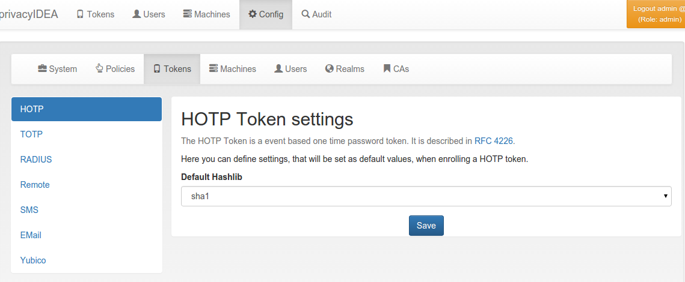

#### 4.4.3.2. HOTP Token Config

HOTP Token configuration

#### 4.4.3.3. SMS OTP Token

The SMS OTP token creates a OTP value and sends this OTP value to the mobile phone of the user. The SMS can be triggered by authenticating with only the OTP PIN:

##### 4.4.3.3.1. First step

In the first step the user will enter his OTP PIN and the sending of the SMS is triggered. The user is denied the access.

##### 4.4.3.3.2. Second step

In the second step the user authenticates with the OTP PIN and the OTP value he received via SMS. The user is granted access.

Alternatively the user can authenticate with the transaction_id that was sent to him in the response during the first step and only the OTP value. The transaction_id assures that the user already presented the first factor (OTP PIN) successfully.

A python SMS provider module defines how the SMS is sent. This can be done using an HTTP SMS Gateway. Most services like Clickatel or sendsms.de provide such a simple HTTP gateway. Another possibility is to send SMS via sipgate, which provides an XMLRPC API. The third possibility is to send the SMS via an SMTP gateway. The proovider receives a specially designed email and sends the SMS accordingly. The last possibility to send SMS is to use an attached GSM modem.

In the field SMS provider you can enter the SMS provider module, you wish to use. In the empty field hit the arrow-down key and you will get a list of the ready made modules.

In the SMS configuration text area you can enter the configuration, which contents is very much dependent on the selected provider module.

The HTTP and the Sipgate module provide a preset-button, which give you an idea of the configuration.