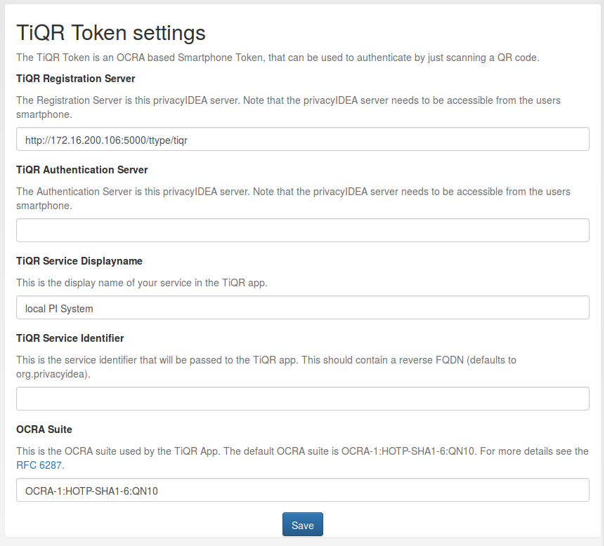

#### 4.4.3.4. TiQR Token Config

TiQR Token configuration

##### 4.4.3.4.1. TiQR Registration Server

You need at least enter the TiQR Registration Server. This is the URL of your privacyIDEA installation, that can be reached from the smartphone during enrollment. So your smartphone needs to be on the same LAN (WLAN) like the privacyIDEA server or the enrollment URL needs to be accessible from the internet.

You also need to specify the path, which is usually /ttype/tiqr.

During enrollment the parameter action=metadata and action=enrollment is added.

> Note:
> 
> We do not recommend putting the registration URL on the internet.

##### 4.4.3.4.2. TiQR Authentication Server

This is the URL that is used during authentication. This can be another URL than the Registration Server. If it is left blank, the URL of the Registration Server is used.

During authentication the parameter operation=login is added.