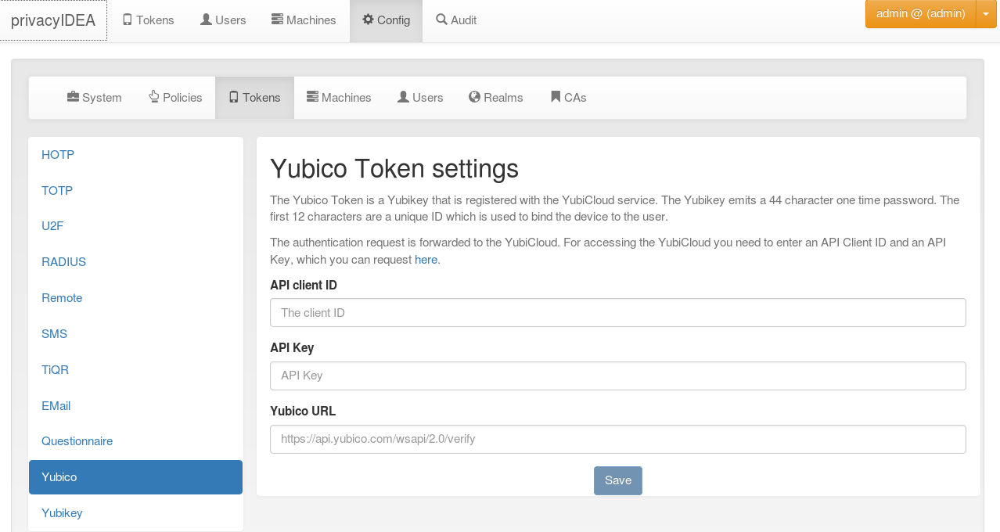

#### 4.4.3.7. Yubico Cloud mode

The Yubico Cloud mode sends the One Time Password emitted by the yubikey to the Yubico Cloud service or another (possibly self hosted) validation server.

Yubico Cloud mode将yubikey发出的OTP发送到Yubico Cloud service或另一个（可能是自建的）验证服务器发出的

Configure the Yubico Cloud mode(配置Yubico Cloud mode)

To contact the Yubico Cloud service you need to get an API key and a Client ID from Yubico and enter these here in the config dialog. In that case you can leave the Yubico URL blank and privacyidea will use the Yubico servers.

要联系Yubico Cloud service，您需要从Yubico获取API密钥和Client ID，并在配置对话框中输入。在这种情况下，您可以将Yubico URL留空，privacyidea将使用Yubico服务器。

You can use another validation host, e.g. a self hosted validation server. If you use privacyidea token type yubikey, you can use the URL https://<privacyideaserver>/ttype/yubikey, other validation servers might use https://<validationserver>/wsapi/2.0/verify. You’ll get the Client ID and API key from the configuration of your validation server.

您可以使用其他验证主机，例如自建验证服务器。如果使用privacyidea的yubikey类型令牌，您可以使用`https://<privacyideaserver>/ttype/yubikey`链接，其他验证服务器可能使用`https://<validationserver>/wsapi/2.0/verify`。您将从验证服务器的配置中获取Client ID和API密钥

You can get your own API key at [[1]](#yubico).

您可以在 [[1]](#yubico)获取自己的API密钥

> [[1]](#id1):
> 
> <https://upgrade.yubico.com/getapikey/>
