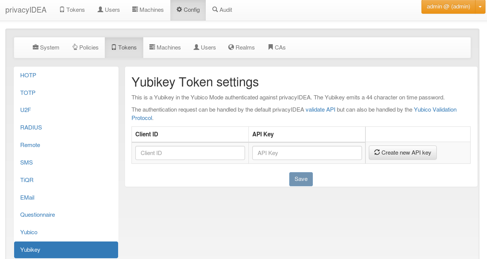

#### 4.4.3.8. Yubikey AES mode

The Yubico AES mode uses the same kind of token as the Yubico Cloud service, but validates the OTP in your local privacyidea server. So the secrets stay local to your system and are not stored in Yubico’s Cloud service.

Yubico AES mode使用与Yubico Cloud服务相同的令牌，但验证本地privacyidea服务器中的OTP。所以私密种子在您的系统本地，不存储在Yubico的云服务。

Configure the Yubikey AES mode(配置Yubikey AES mode)

You can have more than one Client with a Client ID connect to your server. The Client ID starts with yubikey.apiid. and is followed by the API ID, which you’ll need to configure your clients. With create new API key you generate a new API for that specific Client ID. The API key is used to sign the validation request sent to the server and the server signs the answer too. That way tampering or MITM attacks might be detected. It is possible to validate token without the API key, but then the request and answer can’t be verify against the key. It is useful to use HTTPS for your validation requests, but this is another kind of protection.

您可以有多个客户端使用Client ID连接到您的服务器。Client ID以yubikey.apiid开头，后面是需要配置客户端的API ID。通过`create new API key`，您可以为特定的Client ID生成新的API。API密钥用于对发送到服务器的验证请求签名，服务器也对响应签名。这样可能会检测到篡改或MITM攻击。可以在没有API密钥的情况下验证令牌，但是无法根据密钥验证请求和响应。使用HTTPS来验证请求很有用，但这是另一种保护。

OTP validation can either use the privacyidea API /validate/check or the Yubikey validation protocol /ttype/yubikey or - if enabled in your webserver configuration - /wsapi/2.0/verify.

OTP验证可以使用privacyidea API /validate/check或Yubikey验证协议/ttype/yubikey，或者在您的Web服务器配置中启用/wsapi/2.0/verify。