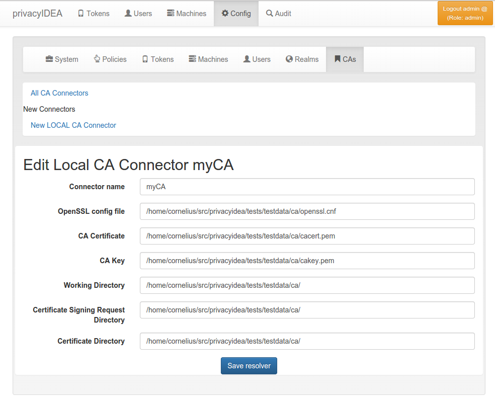
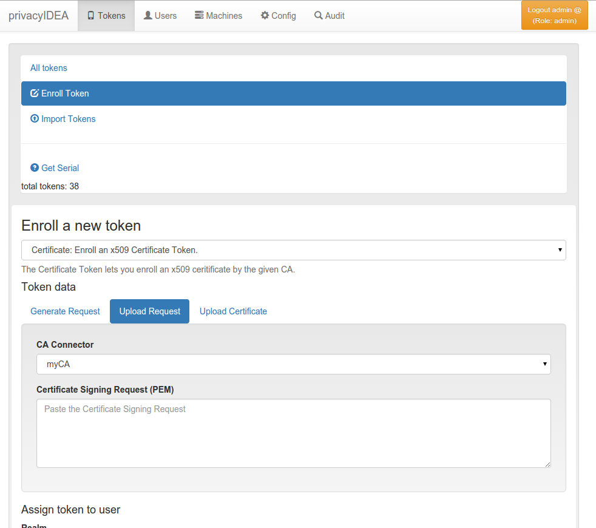

## 4.5. CA Connectors|CA接口

You can use privacyIDEA to enroll certificates and assign certificates to users.

You can define connections to Certifacte Authorities, that are used when enrolling certificates.



A local CA definition

When you enroll a Token of type certificate the Certificate Signing Request gets signed by one of the CAs attached to privacyIDEA by the CA connectors.

The first CA connector that ships with privacyIDEA is a connector to a local openSSL based Certificate Authority as shown in figure A local CA definition.

When enrolling a certificate token you can choose, which CA should sign the certificate request.



Enrolling a certificate token

### 4.5.1. Local CA Connector

The local CA connector calls a local openssl configuration.

Starting with privacyIDEA version 2.12 an example openssl.cnf is provided in /etc/privacyidea/CA/openssl.cnf.

> Note:
> 
> This configuration and also this description is ment to be as an example. When setting up a productive CA, you should ask a PKI consultant for assistance.

1. Modify the parameters in the file /etc/privacyidea/CA/openssl.cnf according to your needs.

2. Create your CA certificate:
```
openssl req -days 1500 -new -x509 -keyout /etc/privacyidea/CA/ca.key \
            -out /etc/privacyidea/CA/ca.crt \
            -config /etc/privacyidea/CA/openssl.cnf
chmod 0600 /etc/privacyidea/CA/ca.key
touch /etc/privacyidea/CA/index.txt
echo 01 > /etc/privacyidea/CA/serial
chown -R privacyidea /etc/privacyIDEA/CA
```

3. Now set up a local CA connector within privacyIDEA with the directory /etc/privacyidea/CA and the files accordingly.