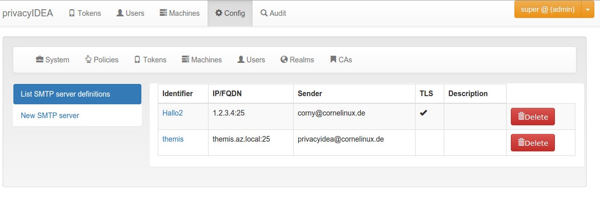
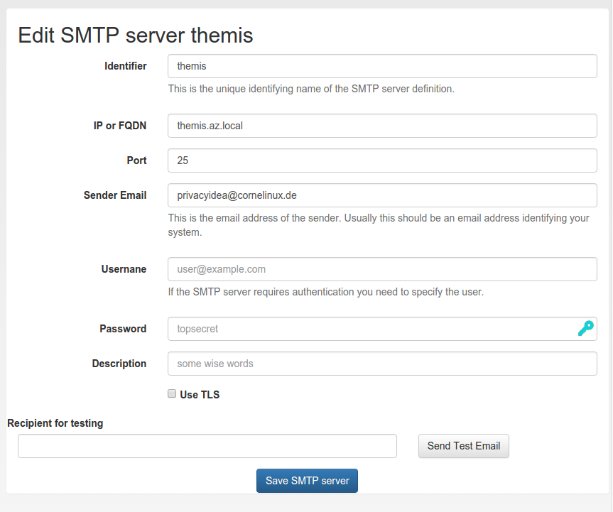

## 4.6. SMTP server configuration|SMTP服务器配置

Starting with privacyIDEA 2.10 you can define SMTP server configurations. SMTP server endpoints.

An SMTP server configuration contains the

* server as FQDN or IP address,
* the port,
* the sender email address,
* a username and password in case of authentication and
* a TLS flag.

Each SMTP server configuration is address via a unique identifier. You can then use such a configuration for Email or SMS token, for PIN handling or for User registration.

Under Config->Sytem->SMTP servers you can get a list of all configured SMTP servers, create new server definitions and delete them.

The list of SMTP servers.

Using the unique identifier like themis you can use this SMTP server definition in e.g. a policy for user registraion.

Edit an existing SMTP server definition.

In the edit dialog you can enter all necessary attributes to talk to the SMTP server. You can also send a test email, to verify if your settings are correct.