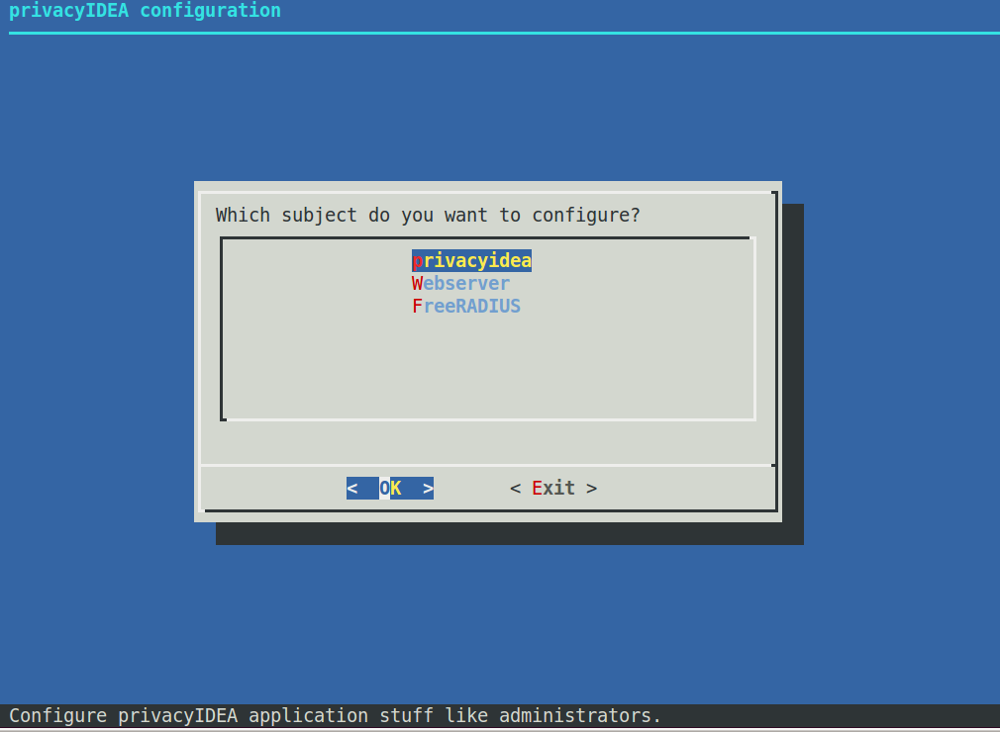
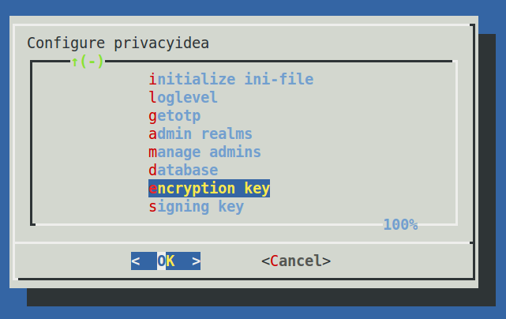
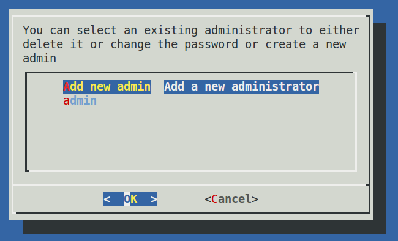
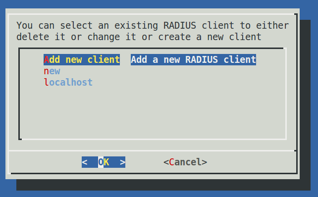
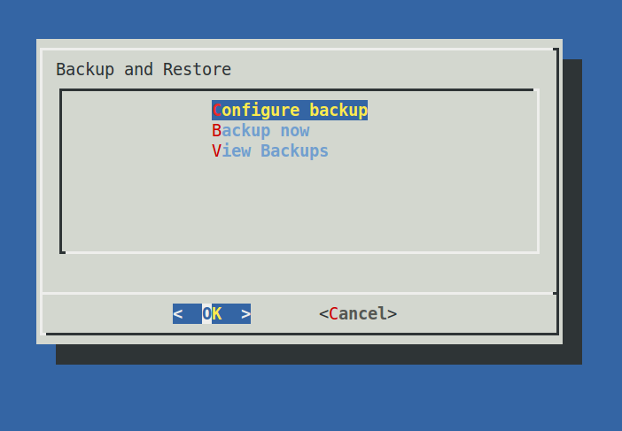
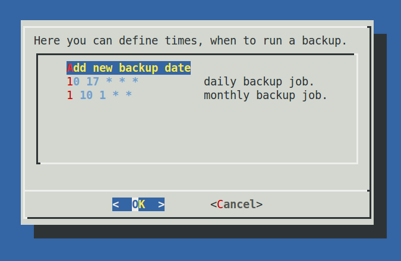
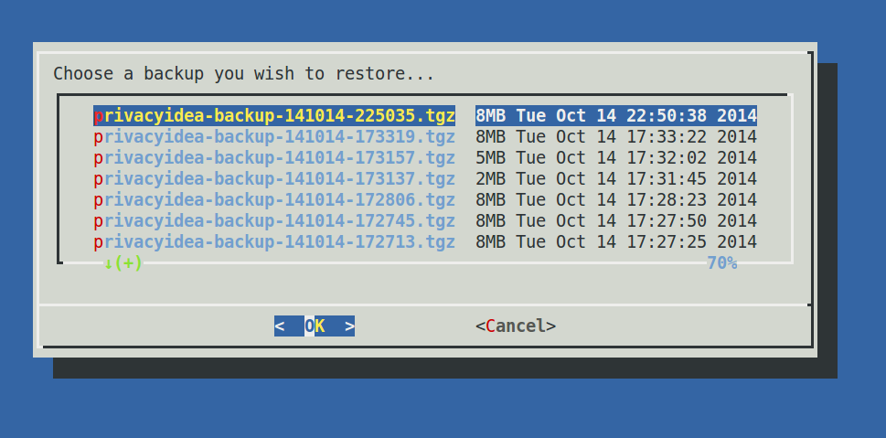

## 4.7. privacyIDEA setup tool|设置工具

privacyIDEA comes with a graphical setup tool to manage your token administrators and RADIUS clients. Thus you will get a kind of appliance experience. To install all necessary components read appliance.

privacyIDEA提供了一个图形设置工具来管理令牌管理员和RADIUS客户端。因此，您将获得一种应用体验。安装读取应用所有必需的组件。

To configure the system, login as the user root on your machine and run the command:

要配置系统，请以计算机的root用户身份登录，然后运行以下命令：

```
privacyidea-setup
```

This will bring you to this start screen.

这将带你到这个开始屏幕。



Start screen of the appliance setup tool.(设置工具应用的开始屏幕)

You can configure privacyidea settings, the log level, administrators, encryption key and much more. You can configure the webserver settings and RADIUS clients.

您可以配置privacyidea设置，日志级别，管理员，加密密钥和更多。您可以配置Web服务器设置和RADIUS客户端。



Configure privacyidea(配置privacyidea)



You can create new token administrators, delete them and change their passwords.(您可以创建新的令牌管理员，删除它们或更改其密码)



In the FreeRADIUS settings you can create and delete RADIUS clients.(在FreeRADIUS设置中，您可以创建或删除RADIUS客户端)

All changes done in this setup tool are directly read from and written to the corresponding configuration files. The setup tool parses the original nginx and freeradius configuration files. So there is no additional place where this data is kept.

在此设置工具中进行的所有更改都将直接从相应的配置文件读取和写入。设置工具解析原始的nginx和freeradius配置文件。因此，不在其他地方保存此数据。

> Note:
> 
> You can also edit the clients.conf and other configuration files manually. The setup tool will also read those manual changes!
> 
> 注：
> 
> 您还可以手动编辑clients.conf和其他配置文件。设置工具也将读取这些手动更改！

### 4.7.1. Backup and Restore

备份和恢复

Starting with version 1.5 the setup tool also supports backup and restore. Backups are written to the directory /var/lib/privacyidea/backup.

从1.5版本开始，设置工具还支持备份和恢复。备份将写入目录/var/lib/privacyidea/backup。

The backup contains all privacyIDEA configuration, the contents of the directory /etc/privacyidea, the encryption key, the configured administrators, the complete token database (MySQL) and Audit log. Furthermore if you are running FreeRADIUS the backup also contains the /etc/freeradius/clients.conf file.

备份包含所有privacyIDEA配置，目录/etc/privacyidea的内容，加密密钥，配置的管理员，完整的令牌数据库（MySQL）和审计日志。此外，如果您运行FreeRADIUS，备份还包含/etc/freeradius/clients.conf文件。



#### 4.7.1.1. Schedulded backup

备份计划任务

At the configuration point Configure Backup you can define times when a scheduled backup should be performed. This information is written to the file /etc/crontab.

在配置点配置备份，您可以定义执行备份的计划任务时间。此信息写入文件/etc/crontab。



Scheduled backup(备份计划任务)

You can enter minutes, hours, day of month, month and day of week. If the entry should be valid for each e.g. month or hour, you need to enter a ‘*’.

In this example the 10 17 * * * (minute=10, hour=17) means to perform a backup each day and each month at 17:10 (5:10pm).

The example 1 10 1 * * (minute=1, hour=10, day of month=1) means to perform a backup on the first day of each month at 10:01 am.

Thus you could also perform backups only once a week at the weekend.

您可以输入分钟，小时，日期，月份和星期几。如果该条目总是有效的，您需要输入‘*’。在上面例子中，10 17 * * * (分钟=10，小时=17)表示每月每天的17:10 (5:10pm)执行备份。1 10 1 * * (分钟=1，小时=10，日期=1)表示每月1号的10:01 am执行备份。因此，您也可以在仅每周周末执行一次备份。（笔者注：同Linux的计划任务）

#### 4.7.1.2. Immediate backup

立即备份

If you want to run a backup right now you can choose the entry Backup now.

如果要立即运行备份，您可以选择条目Backup now。

#### 4.7.1.3. Restore

恢复

The entry View Backups will list all the backups available.

条目“View Backups”将列出所有可用的备份。



All available backups(所有可用的备份)

You can select a backup and you are asked if you want to restore the data.

您可以选择一个备份，会询问您是否要还原数据。

> Warning:
> 
> Existing data is overwritten and will be lost.
> 
> 警告：
> 
> 现有数据会被覆盖，并将丢失。

笔者注：我在CentOS7按照官方安装教程（把本手册大概翻完后再把CentOS7上的安装教程整理在这里）安装完成后调不出这个界面。