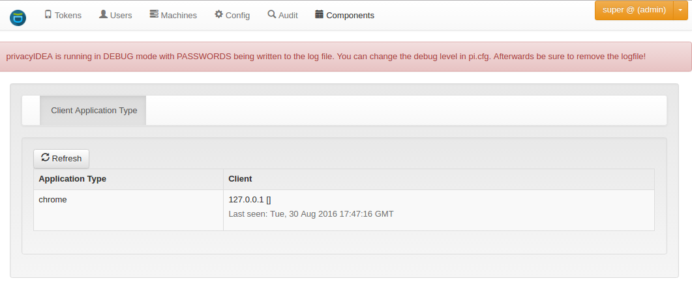

# 5. Components|组件

Starting with privacyIDEA 2.15 you can see privacyIDEA components in the Web UI. privacyIDEA collects authenticating clients with their User Agent. Usually this is a type like PAM, FreeRADIUS, OTRS, Wordpress... This overview helps you to understand your network and keep track which clients are connected to your network.

从privacyIDEA 2.15开始，您可以在Web界面中看到privacyIDEA组件。privacyIDEA通过其用户代理收集认证客户端。通常是类似PAM，FreeRADIUS，OTRS，Wordpress等。此概述可帮助您了解您的网络，并跟踪哪些客户端连接到您的网络。

components(组件)