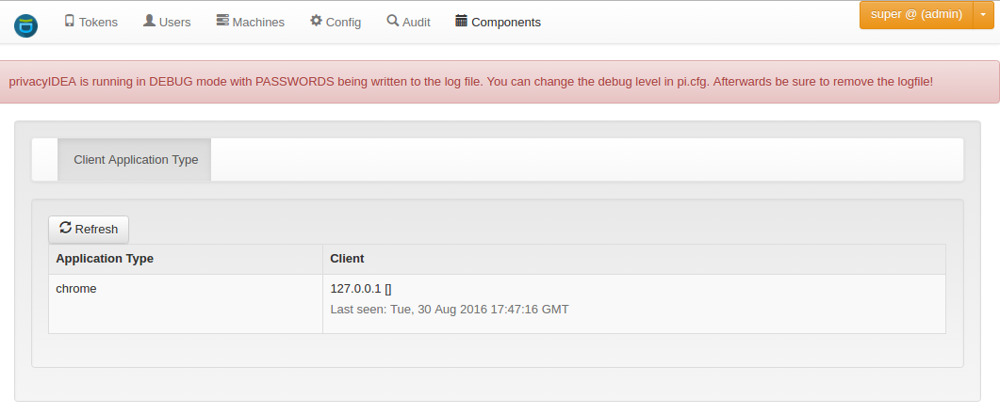

# 5. Components|组件

Starting with privacyIDEA 2.15 you can see privacyIDEA components in the Web UI. privacyIDEA collects authenticating clients with their User Agent. Usually this is a type like PAM, FreeRADIUS, OTRS, Wordpress... This overview helps you to understand your network and keep track which clients are connected to your network.

components