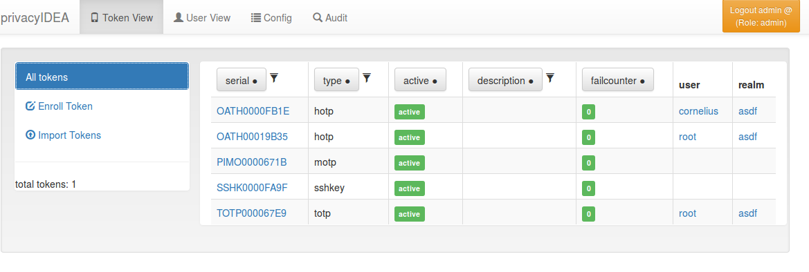
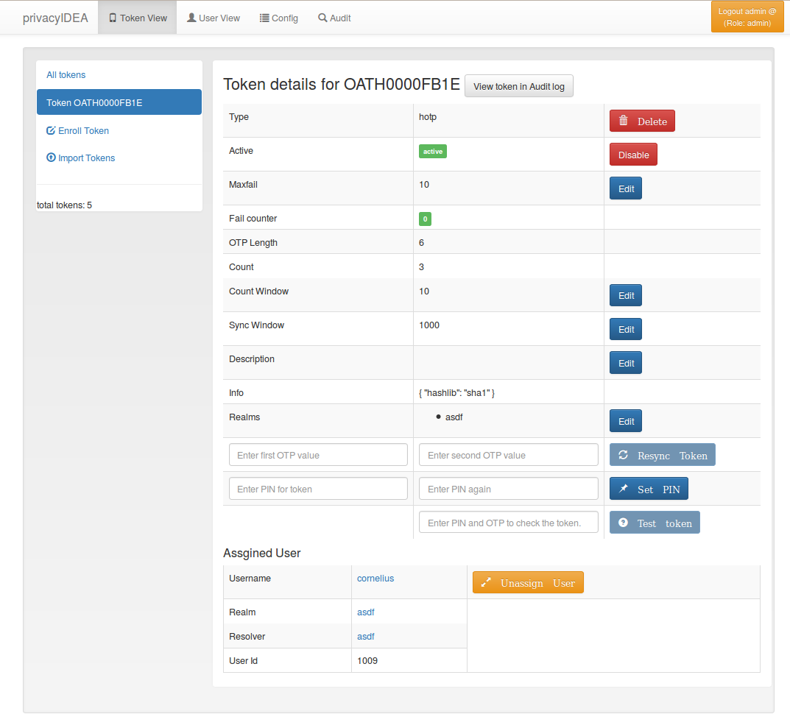
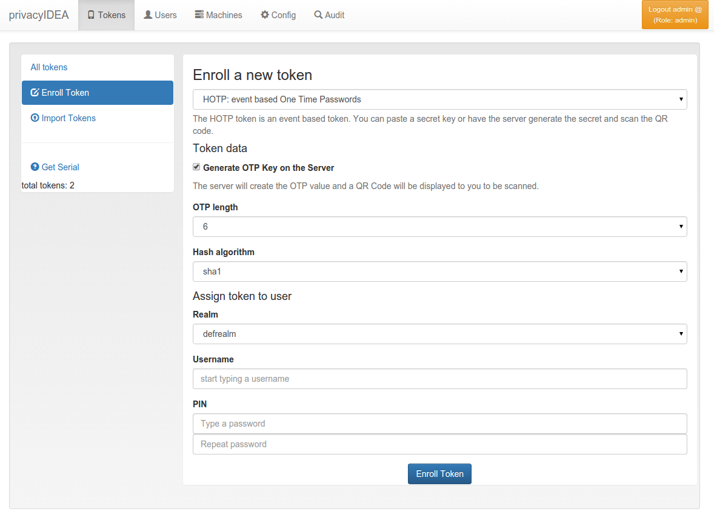

# 6. Tokenview|令牌视图

The administrator can see all the tokens of all realms he is allowed to manage in the tokenview. Each token can be located in several realms and be assigned to one user. The administrator can see all the details of the token.

管理员可以看到他在令牌视图中被允许管理的所有领域的所有令牌。每个令牌可以位于多个域中并被分配给一个用户。管理员可以看到令牌的所有详细信息。

Token View(令牌视图)

The administrator can click on one token, to show more details of this token and to perform actions on this token.

管理员可以单击一个令牌，以显示此令牌的更多详细信息，并对此令牌进行操作。

## 6.1. Token Details

令牌详细信息

The Token Details give you more information about the token and also let the administrator perform specific tasks for this token.

Token Details为您提供有关令牌的更多信息，并管理员可为此令牌执行特定任务。

Token Detail(令牌详细信息)

At the bottom you see the assigned user. You can click on the username and change to the User Details.

在底部，您会看到已分配的用户。您可以单击用户名切换为User Details。

### 6.1.1. Lost token

丢失令牌

When a user has lost a token, the administrator or the user can create a temporary password token for the user to login.

当用户丢失令牌时，管理员或用户可以创建用于临时登录的密码令牌。

The administrator has to select the token that was lost and click the button Lost token. A new token of type PW is generated. The OTP PIN of the old token is automatically copied to the new token. Thus the administrator does not know the OTP PIN, while the user can use his old PIN.

A long password is displayed to the administrator and the administrator can read this password to the user. The user now can authenticate with his old OTP PIN and the long password.

The lost token is deactivated.

### 6.1.2. Get Serial

The administrator can enter a OTP value that was generated by an unknown token. Then the serial number for the corresponding token is search and displayed.

> Note:
> 
> Since OTP values for all matching tokens need to be calculated,

this can be time consuming!

### 6.1.3. Token settings

You can change the following token settings.

**MaxFail and FailCount**

If the login fail counter reaches the MaxFail the user can not login with this token anymore. The Failcounter FailCount has to be reset to zero.

**TokenDesc**

The token description is also displayed in the tokenview. You can set a description to make it easier to identify a token.

**CountWindow**

The CountWindow is the look ahead window of event based tokens. If the user pressed the button on an event based token the counter in the token is increased. If the user does not use this otp value to authenticate, the server does not know, that the counter in the token was increased. This way the counter in the token can get out of sync with the server.

**SyncWindow**

If a token was out of sync (see CountWindow), then it needs to be synchronized. This is done by entering two consecutive OTP values. The server searches these two values within the next CountWindow (default 1000) values.

**OtpLen**

This is the length of the OTP value that is generated by the token. The password that is entered by the user is split according to this length. 6 or 8 characters are split as OTP value and the rest is used as static password (OTP PIN).

**Hashlib**

The HOTP algorithm can be used with SHA1 or SHA256.

**Tokeninfo - Auth max**

The administrator can set a value how often this token may be used for authentication. If the number of authentication try exceed this value, the token can not be used, until this Auth max value is increased.

> Note:
> 
> This way you could create tokens, that can be used only once.

**Tokeninfo - Auth max success**

The administrator can set a value how often this token may be used to successfully authenticate.

**Tokeninfo - Valid start**

A timestamp can be set. The token will only be usable for authentication after this start time.

**Tokeninfo - Valid end**

A timestamp can be set. The token can only be used before this end time.

> Note:
> 
> This way you can create temporary tokens for guests or short time or season employees.

### 6.1.4. Resync Token

The administrator can select one token and then enter two consecutive OTP values to resynchonize the token if it was out of sync.

### 6.1.5. set token realm

A token can be assigned to several realms. This is important if you have administrators for different realms. A realm administrator is only allowed to see tokens within his realms. He will not see tokens, that are not in his realm. So you can assign a token to realm A and realm B, thus the administrator A and the administrator B will be able to see the token.

### 6.1.6. get OTP

If the corresponding getOTP policy (Policies) is set, the administrator can get the OTP values of a token from the server without having the token with him.

> Note:
> 
> Of course this is a potential backdoor, since the administrator could login as the user/owner of this very token.

### 6.1.7. enroll

You can enroll a token either from the Token View or from the User Details. When enrolling a token from the User Details the token is directly assigned to the user.

If you enroll the token from the token view, you can select a user, to whom the token will be assigned.

When enrolling a token, you can select the token type and according to the token type other necessary information.

Token enrollment dialog

### 6.1.8. assign

This function is used to assign a token to a user. Select a realm and start typing a username to find the user, to whom the token should be assigned.

### 6.1.9. unassign

In the token details view you can unassign the token. After that, the token can be assigned to a new user.

### 6.1.10. enable
If a token is disabled, it can be enabled again.

### 6.1.11. disable

Tokens can be disabled. Disabled tokens still belong to the assigned user but those tokens can not be used to authenticate. Disabled tokens can be enabled again.

### 6.1.12. set PIN

You can set the OTP PIN or the mOTP PIN for tokens.

### 6.1.13. Reset Failcounter

If a used locked his token, since he entered wrong OTP values or wrong OTP PINs, the fail counter has reached the mail failcount. The administrator or help desk user can select those tokens and click the button reset failcounter to reset the fail counter to zero. The tokens can be used for authentication again.

### 6.1.14. delete

Deleting a token will remove the token from the database. The token information can not be recovered. But all events that occurred with this token still remain in the audit log.