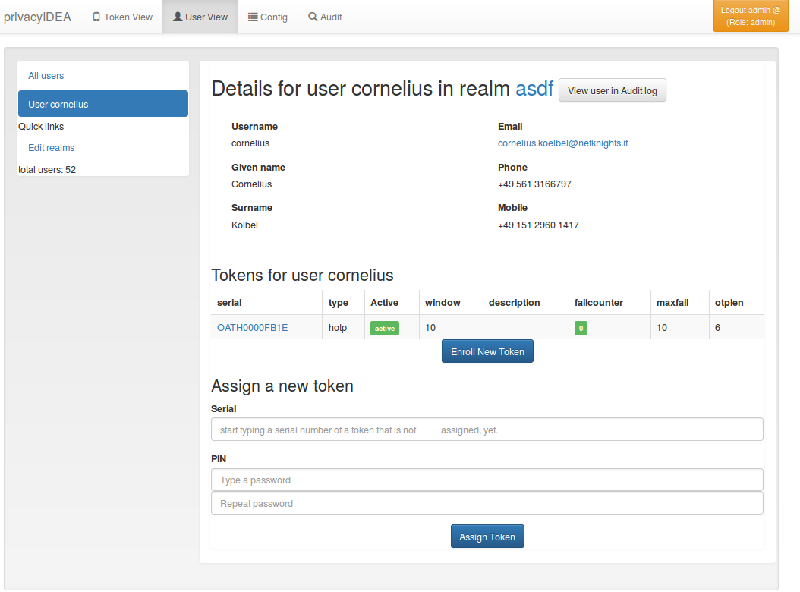

## 7.1. User Details|用户细节

When clicking on a username, you can see the users details and perform several actions on the user.

点击用户名后，您可以查看用户详细信息并对用户进行一些操作。

User Details.(用户详细信息)

You see a list of the users tokens and change to the [Token Details](../6. Tokenview 令牌视图/Introduction.html#61-token-details).

您可以看到用户令牌的列表并切换到[Token Details](../6. Tokenview 令牌视图/Introduction.html#61-token-details)。

### 7.1.1. Enroll tokens

注册令牌

In the users details view you can enroll additional tokens to the user. In the enrollment dialog the user will be selected and you only need to choose what tokentype you wish to enroll for this user.

### 7.1.2. Assign tokens

分配令牌

You can assign a new, already existing token to the user. Just start typing the token serial number. The system will search for tokens, that are not assigned yet and present you a list to choose from.

您可以为用户分配一个新的已有令牌。只需键入令牌序列号。系统将搜索尚未分配的令牌，并提供可供选择的列表。

### 7.1.3. View Audit Log

查看审计日志

You can also click View user in Audit log which will take you to the [Audit](../10. Audit 审计/Introduction.html) log with a filter on this very user, so that you will only see audit entries regarding this user.

您还可以单击View user in Audit log，这将带您转到[Audit](../10. Audit 审计/Introduction.html)日志，并使用过滤器，以便您能只查看有关此用户的审计条目。

### 7.1.4. Edit user

编辑用户

If the user is located in a resolver, that is marked as editable, the administrator will also see a button “Edit User”. To read more about this, see [Manage Users](../7. Userview 用户视图/7.2. Manage Users 管理用户.html).

如果用户位于解析器中，标记为可编辑，则管理员还将看到“Edit User”按钮。有关详细信息，请参阅[Manage Users](../7. Userview 用户视图/7.2. Manage Users 管理用户.html)。