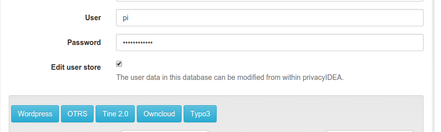
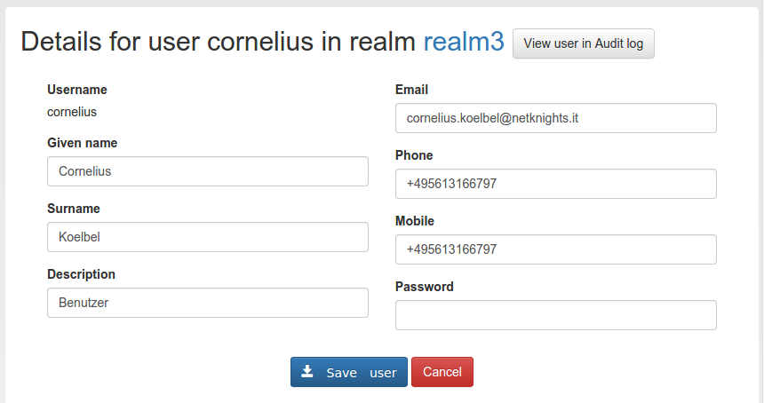
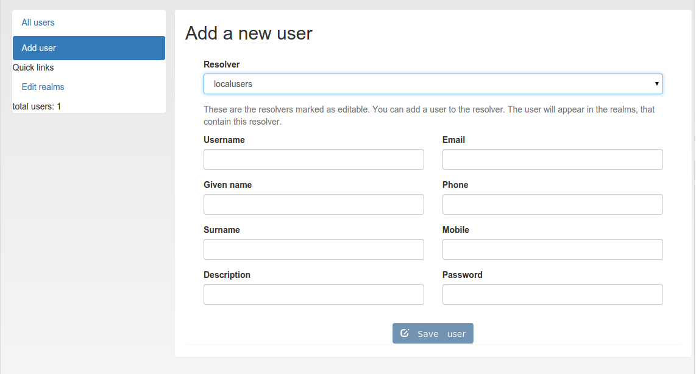

## 7.2. Manage Users|管理用户

Since version 2.4 privacyIDEA allows you to edit users in the configured resolvers. At the moment this is possible for SQL resolvers.

In the resolver definition you need to check the new checkbox **Edit user store**.

从2.4版本开始，privacyIDEA允许您在配置的解析器中编辑用户。目前SQL解析器可以。在解析器定义中，您需要选中复选框**Edit user store**。（笔者注：2.15版本中，LDAP解析器也是有此选项的）




Users in SQL can be edited, when checking the checkbox.(当选中复选框时，可以编辑SQL中的用户)

In the Users Detail view, the administrator then can click the button “Edit” and modify the user data and also set a new password.

在用户详细信息视图中，管理员可以单击“Edit”按钮来修改用户数据或设置新密码。



Edit the attributes of an existing user.(编辑现有用户的属性)

> Note:
> 
> The data of the user will be modified in the user store (database). Thus the users data, which will be returned by a resolver, is changed. If the resolver is contained in several realms these changes will reflect in all realms.
> 
> 注：
> 
> 将在用户源（数据库）中修改用户的数据。因此，由解析器返回的用户数据被改变。如果解析器包含在多个域中，这些改变将反映在所有域。

If you want to add a user, you can click on Add User in the User View.

如果要添加用户，可以在用户视图中单击Add user。



Add a new user.(新建用户)

Users are contained in resolvers and added to resolvers. So you need to choose an existing resolver and not a realm. The user will be visible in all realms, the resolver is contained in.

用户包含在解析器中也是被添加到解析器中。所以你需要选择一个已有的解析器而不是一个域。用户在所有包含了该解析器的域都可见。

> Note:
> 
> Of course you can set policies to allow or deny the administrator these rights.
> 
> 注：
> 
> 当然，您可以设置策略以允许或拒绝管理员拥有这些权限。

### 7.2.1. Simple local users setup

简单的本地用户设置

You can setup a local users definition quite easily. Run:

您可以很容易地设置本地用户定义。运行：

```
pi-manage resolver create_internal test
```

This will create a database table “users_test” in your token database. And it will create a resolver “test” that refers to this database table.

Then you can add this resolver to realm:

这将在您的令牌数据库中创建一个数据库表“users_test”。并且创建一个引用此数据库表的解析器“test”。

```
pi-manage realm create internal_realm test
```

Which will create a realm “internal_realm” containing the resolver “test”. Now you can start adding users to this resolver as described above.

> Note:
> 
> This is an example of how to get started with users quite quickly. Of course you do not need to save the users table in the same database as the tokens. But in scenarios, where you do not have existing user stores or the user stores are managed by another department or are not accessible easily this may be sensible way.