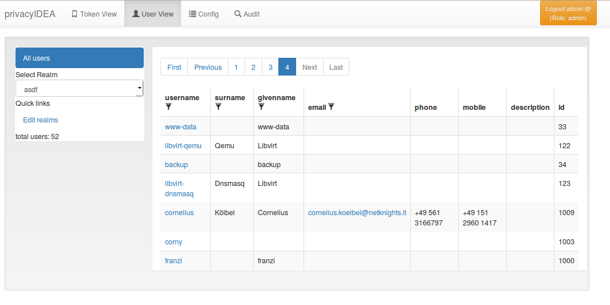

# 7. Userview|用户视图

The administrator can see all users in realms he is allowed to manage.

管理员可以看到他被允许管理的所有用户。

> Note:
> 
> Users are only visible, if the useridresolver is located within a realm. If you only define a useridresolver but no realm, you will not be able to see the users!
> 
> 注：
> 
> 只有当用户ID解析器位于某个域时，用户才可见。如果你只定义一个用户ID解析器但没有域，你将无法看到用户！

You can select one of the realms in the left drop down box. The administrator will only see the realms in the drop down box, that he is allowed to manage. **(TODO)** No migrated, yet.

您可以在左边下拉框中选择一个域。管理员在下拉框中只会看到他被允许管理的域。**（待做）**尚未迁移。

User View. List all users in a realm.

The list shows the users from the select realm. The username, surname, given name, email and phone are filled according to the definition of the useridresolver.

Even if a realm contains several useridresolvers all users from all resolvers within this realm are displayed.

* [7.1. User Details](7.1. User Details 用户细节.md)
* [7.2. Manage Users](7.2. Manage Users 管理用户.md)