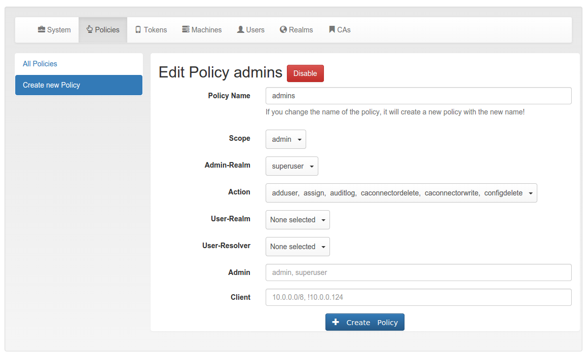

## 8.1. Admin policies|管理员策略

Admin policies are used to regulate the actions that administrators are allowed to do. Technically admin policies control the use of the REST API Token endpoints, System endpoints, Realm endpoints and Resolver endpoints.

管理员策略用于管理允许管理员执行的操作。技术上，管理员策略控制REST API Token endpoints，System endpoints，Realm endpoints和Resolver endpoints的使用。

Admin policies are implemented as decorators in Policy Module and Policy Decorators.

管理员策略在Policy Module和Policy Decorators中实现为装饰器。

The user in the admin policies refers to the name of the administrator.

管理员策略中的user是指管理员的名称。

Starting with privacyIDEA 2.4 admin policies can also store a field “admin realm”. This is used, if you define realms to be superuser realms. See The Config File for information how to do this.

从privacyIDEA 2.4开始管理员策略也可以存储字段“admin realm”。如果您将域定义为超级用户域，则使用此选项。有关如何执行此操作的信息，请参阅The Config File。

This way it is easy to define administrative rights for big groups of administrative users like help desk users in the IT department.

这样，可以轻松地为大量的管理用户（如IT部门的帮助台用户）定义管理权限。

Admin scope provides and additional field ‘admin realm’.(Admin作用域提供了额外字段“Admin-Realm”)

All administrative actions also refer to the defined user realm. Meaning an administrator may have many rights in one user realm and only a few rights in another realm.

所有管理操作还引用定义的用户域。意味着管理员可以在一个用户域中有许多权限，而在另一个域中只有少数权限。

Creating a policy with scope:admin, admin-realm:helpdesk, user:frank, action:enable and realm:sales means that the administrator frank in the admin-realm helpdesk is allowed to enable tokens in the user-realm sales.

创建策略Scope:admin，Admin-Realm:helpdesk，User:frank，Action:enable和User-Realm:sales表示管理员可以在Admin-Realm helpdesk中启用用户域sales中的令牌。

> Note:
> 
> As long as no admin policy is defined all administrators are allowed to do everything.
> 
> 注：
> 
> 只要没有定义管理员策略，所有管理员都可以执行所有操作。

The following actions are available in the scope admin:

管理员作用域内有以下操作：

### 8.1.1. init

type: bool(类型：布尔型)

There are init actions per token type. Thus you can create policy that allow an administrator to enroll SMS tokens but not to enroll HMAC tokens.

每种类型的令牌都有init操作。因此，您可以创建允许管理员注册SMS令牌但不能注册HMAC令牌的策略。

### 8.1.2. enable

type: bool(类型：布尔型)

The enable action allows the administrator to activate disabled tokens.

enable操作允许管理员激活禁用的令牌。

### 8.1.3. disable

type: bool(类型：布尔型)

Tokens can be enabled and disabled. Disabled tokens can not be used to authenticate. The disable action allows the administrator to disable tokens.

令牌可以被启用和禁用。被禁用的令牌不能用于认证。disable操作允许管理员禁用令牌。

### 8.1.4. revoke

type: bool(类型：布尔型)

Tokens can be revoked. Usually this means the token is disabled and locked. A locked token can not be modified anymore. It can only be deleted.

Certain token types like certificate may define special actions when revoking a token.

令牌可以被吊销。通常这意味着令牌被禁用和锁定。无法再修改锁定的令牌。它只能被删除。某些类型的令牌（如证书）可以在吊销令牌时定义特殊动作。

###　8.1.5. set

type: bool(类型：布尔型)

Tokens can have additional token information, which can be viewed in the Token Details.

If the set action is defined, the administrator allowed to set those token information.

令牌可以有额外的令牌信息，可以在Token Details中查看。如果定义了set操作，管理员允许设置这些令牌信息。

###　8.1.6. setpin

type: bool(类型：布尔型)

If the setpin action is defined, the administrator is allowed to set the OTP PIN of a token.

如果定义了setpin操作，管理员可以设置令牌的OTP PIN。

###　8.1.7. enrollpin

type: bool(类型：布尔型)

If the action enrollpin is defined, the administrator can set a token PIN during enrollment. If the action is not defined and the administrator tries to set a PIN during enrollment, this PIN is deleted from the request.

如果定义了enrollpin操作，管理员可以在令牌注册期间设置令牌PIN。如果未定义操作并且管理员尝试在令牌注册期间设置PIN，则会从请求中删除此PIN。

###　8.1.8. resync

type: bool(类型：布尔型)

If the resync action is defined, the administrator is allowed to resynchronize a token.

如果定义了resync操作，则允许管理员同步令牌。

###　8.1.9. assign

type: bool(类型：布尔型)

If the assign action is defined, the administrator is allowed to assign a token to a user. This is used for assigning an existing token to a user but also to enroll a new token to a user.

Without this action, the administrator can not create a connection (assignment) between a user and a token.

如果定义了assign操作，则允许管理员为用户分配令牌。可用于将现有的令牌分配给用户或给用户注册新的令牌。没有定义此操作，管理员无法使用户和令牌关联（分配）。

###　8.1.10. unassign

type: bool(类型：布尔型)

If the unassign action is defined, the administrator is allowed to unassign tokens from a user. I.e. the administrator can remove the link between the token and the user. The token still continues to exist in the system.

如果定义了unassign操作，则管理员可以从用户中取消分配令牌。也就是说，管理员可以删除令牌和用户之间的关联。令牌仍然在系统中继续存在。

###　8.1.11. import

type: bool(类型：布尔型)

If the import action is defined, the administrator is allowed to import token seeds from a token file, thus creating many new token objects in the systems database.

如果定义了import操作，则管理员可以从令牌文件导入令牌种子，从而在系统数据库中创建许多新令牌对象。

###　8.1.12. remove

type: bool(类型：布尔型)

If the remove action is defined, the administrator is allowed to delete a token from the system.

如果定义了remove操作，则管理员可以从系统中删除令牌。

> Note:
> 
> If a token is removed, it can not be recovered.
> 
> Note:
> 
> All audit entries of this token still exist in the audit log.
> 
> 注：
> 
> 被删除的令牌无法恢复。
> 
> 注：
> 
> 被删除的令牌的所有审计条目仍然存在于审计日志中。

### 8.1.13. userlist

type: bool(类型：布尔型)

If the userlist action is defined, the administrator is allowed to view the user list in a realm. An administrator might not be allowed to list the users, if he should only work with tokens, but not see all users at once.

如果定义了userlist操作，则管理员可以在域中查看用户列表。如果管理员只能对令牌操作，但不能同时查看所有用户，则可能不允许管理员列出用户。

> Note:
> 
> If an administrator has any right in a realm, the administrator is also allowed to view the token list.
> 
> 注：
> 
> 如果管理员在某个域具有任何权限，管理员还可以查看令牌列表。

### 8.1.14. checkstatus

type: bool(类型：布尔型)

If the checkstatus action is defined, the administrator is allowed to check the status of open challenge requests.

如果定义了checkstatus操作，则管理员可以检查打开的挑战请求的状态。

### 8.1.15. manageToken

type: bool(类型：布尔型)

If the manageToken action is defined, the administrator is allowed to manage the realms of a token.

A token may be located in multiple realms. This can be interesting if you have a pool of spare tokens and several realms but want to make the spare tokens available to several realm administrators. (Administrators, who have only rights in one realm)

Then all administrators can see these tokens and assign the tokens. But as soon as the token is assigned to a user in one realm, the administrator of another realm can not manage the token anymore.

如果定义了manageToken操作，则允许管理员管理令牌的域。令牌可以位于多个域。这可能很有趣：如果你有一个备用令牌池和几个域，但想要让备用令牌可用于几个域的管理员（只在一个域中有权限的管理员）。然后所有管理员可以看到这些令牌，并可分配令牌。但是一旦将令牌分配给一个域中的某个用户，其他域的管理员就不能再管理该令牌。

### 8.1.16. getserial

type: bool(类型：布尔型)

If the getserial action is defined, the administrator is allowed to calculate the token serial number for a given OTP value.

如果定义了getserial操作，则允许管理员计算给定OTP值的令牌序列号。

### 8.1.17. getrandom

type: bool(类型：布尔型)

The getrandom action allows the administrator to retrieve random keys from the endpoint getrandom. This is an endpoint in System endpoints.

getrandom can be used by the client, if the client has no reliable random number generator. Creating API keys for the Yubico Validation Protocol uses this endpoint.

getrandom操作允许管理员从端点getrandom检索随机密钥。这是System endpoints中的端点。getrandom可以由客户端使用，如果客户端没有可靠的随机数生成器。为Yubico验证协议创建API密钥使用此端点。

### 8.1.18. getchallenges

type: bool(类型：布尔型)

This policy allows the administrator to retrieve a list of active challenges of a challenge response tokens. The administrator can view these challenges in the web UI.

此策略允许管理员检索挑战响应令牌的活动挑战的列表。管理员可以在Web界面中查看这些挑战。

### 8.1.19. losttoken

type: bool(类型：布尔型)

If the losttoken action is defined, the administrator is allowed to perform the lost token process.

To only perform the lost token process the actions copytokenuser and copytokenpin are not necessary!

如果定义了losttoken操作，则允许管理员执行lost token过程。如果只执行lost token过程，copytokenuser操作和copytokenpin操作不是必要的！

### 8.1.20. adduser

type: bool(类型：布尔型)

If the adduser action is defined, the administrator is allowed to add users to a user store.

如果定义了adduser操作，则允许管理员添加用户到用户源。

> Note:
> 
> The user store still must be defined as editable, otherwise no users can be added, edited or deleted.
> 
> 注：
> 
> 用户源必须定义为可编辑，否则不能添加，编辑或删除用户。

### 8.1.21. updateuser

type: bool(类型：布尔型)

If the updateuser action is defined, the administrator is allowed to edit users in the user store.

如果定义了updateuser操作，则允许管理员编辑用户源中的用户。

### 8.1.22. deleteuser

type: bool(类型：布尔型)

If the deleteuser action is defined, the administrator is allowed to delete an existing user from the user store.

如果定义了deleteuser操作，则允许管理员从用户源中删除现有用户。

### 8.1.23. copytokenuser

type: bool(类型：布尔型)

If the copytokenuser action is defined, the administrator is allowed to copy the user assignment of one token to another.

This functionality is also used during the lost token process. But you only need to define this action, if the administrator should be able to perform this task manually.

如果定义了copytokenuser操作，则允许管理员将一个令牌的用户分配复制到另一个令牌。此功能也在lost token过程中使用。但是您只需要定义此操作，如果管理员能够手动执行此任务。

### 8.1.24. copytokenpin

type: bool(类型：布尔型)

If the copytokenpin action is defined, the administrator is allowed to copy the OTP PIN from one token to another without knowing the PIN.

This functionality is also used during the lost token process. But you only need to define this action, if the administrator should be able to perform this task manually.

如果定义了copytokenpin操作，则允许管理员在不知道PIN的情况下将OTP PIN从一个令牌复制到另一个令牌。此功能也在lost token过程中使用。但是您只需要定义此操作，如果管理员能够手动执行此任务。

### 8.1.25. smtpserver_write

type: bool(类型：布尔型)

To be able to define new SMTP server configuration or delete existing ones, the administrator needs this rights smtpserver_write.

若要允许定义新的SMTP server configuration或删除现有的SMTP服务器配置，管理员需要此smtpserver_write权限。

### 8.1.26. eventhandling_write

type: bool(类型：布尔型)

Allow the adminstrator to configure Event Handler.

允许管理员配置Event Handler。