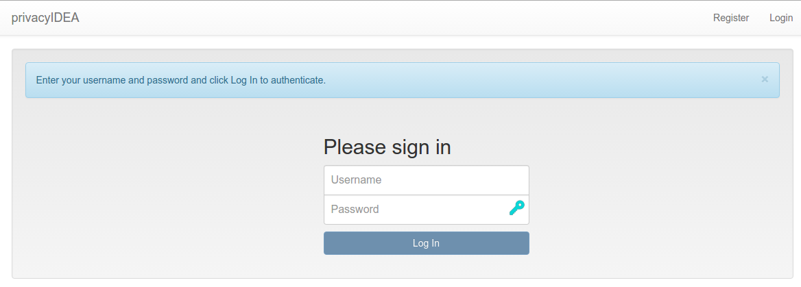
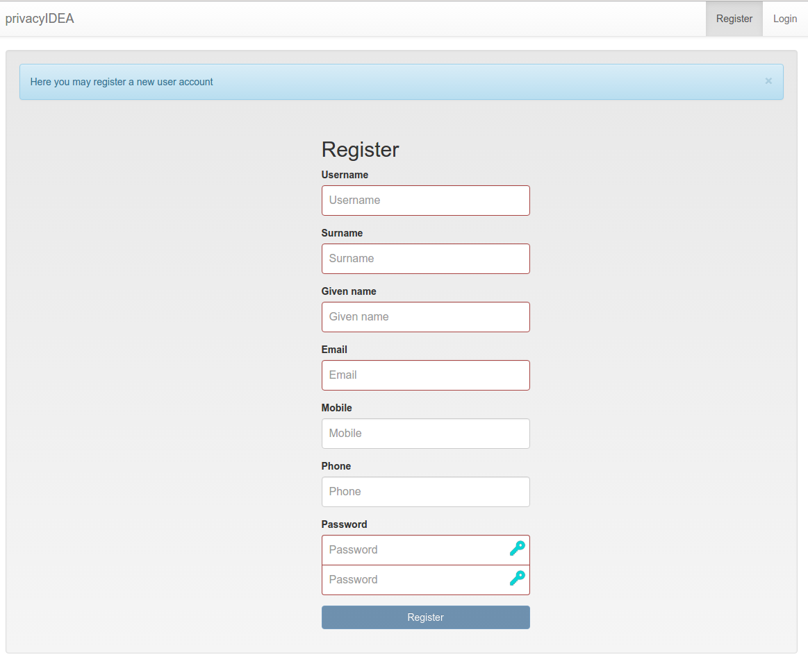
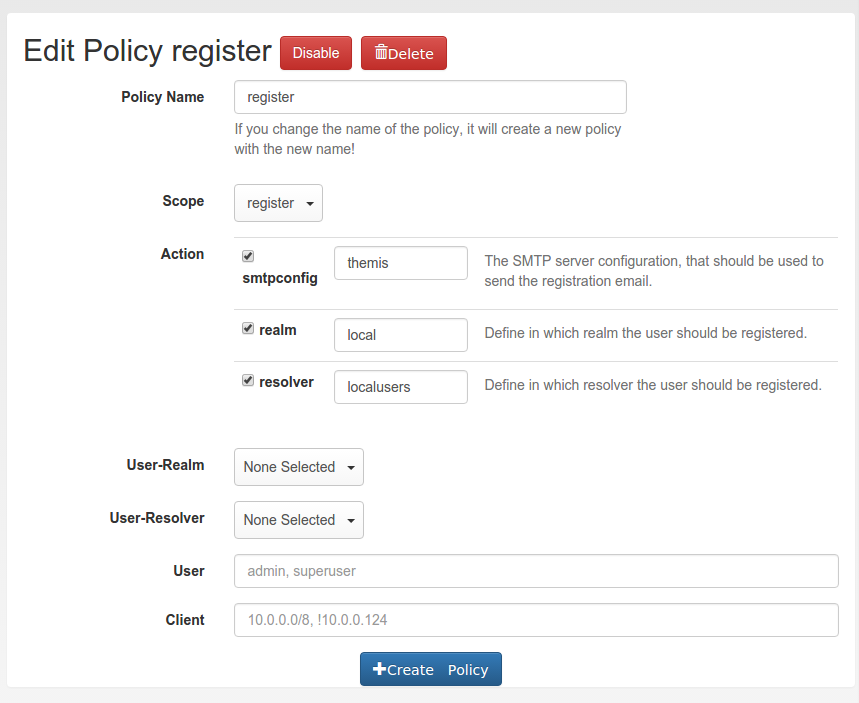

##8.9. Register Policy|注册策略

### 8.9.1. User registration

Starting with privacyIDEA 2.10 users are allowed to register with privacyIDEA. I.e. a user that does not exist in a given realm and resolver can create a new account.

从privacyIDEA 2.10开始允许用户注册privacyIDEA。也就是说，在给定域和解析器中不存在的用户可以创建新帐户。

> Note:
> 
> Registering new users is only possible, if there is a writeable resolver and if the necessary policy in the scope register is defined. For editable UserIdResolvers see [UserIdResolvers](../4. Configuration 配置/4.1. UserIdResolvers 用户ID解析器.html).
> 
> 注：
> 
> 只有在有可写的解析器并且定义了注册作用域中的必要策略时，才可以注册新用户。对于可编辑的用户ID解析器，请参阅[UserIdResolvers](../4. Configuration 配置/4.1. UserIdResolvers 用户ID解析器.html)。

If a register policy is defined, the login window of the Web UI gets a new link “Register”.

如果定义了注册策略，Web界面的登录窗口会显示一个新的链接“Register”。



Next to the login button is a new link ‘register’, so that new users are able to register.(在“Log in”旁边有一个新的链接“Register”，以便新用户能够注册)

A user who clicks the link to register a new account gets this registration dialog:

点击链接注册新帐户的用户会进入此注册对话框：



Registration form(注册表单)

During registration the user is also enrolled [Registration](../4. Configuration 配置/4.4.2.8. Registration.html) token. This registration code is sent to the user via a notification email.

在注册期间，用户也注册[Registration](../4. Configuration 配置/4.4.2.8. Registration.html)令牌。此注册代码以电子邮件通知发送给用户。

> Note:
> 
> Thus - using the right policies in scope webui and authentication - the user could login with the password he set during registration an the registration code he received via email.
> 
> 注：
> 
> 因此，在Web界面作用域和认证作用域中使用正确的策略，用户可以用他在注册期间设置的密码登录他通过电子邮件接收的注册码。

### 8.9.2. Policy settings

In the scope register several settings define the behaviour of the registration process.

在注册作用域中，几个设置定义注册过程的行为。



Creating a new registration policy(创建一个新的注册策略)

#### 8.9.2.1. realm

type: string(类型：字符串)

This is the realm, in which a new user will be registered. If this realm is not specified, the user will be registered in the default realm.

这是新用户将被注册到的域。如果未指定此域，则用户将在默认域中注册。

#### 8.9.2.2. resolver

type: string(类型：字符串)

This is the resolver, in which the new user will be registered. If this resolver is not specified, **registration is not possible!**

这是新用户将被注册到的解析器。如果未指定此解析器，将不能注册！

> Note:
> 
> This resolver must be an editable resolver, otherwise the user can not be created in this resolver.
> 
> 注：
> 
> 此解析器必须是可编辑的解析器，否则无法在此解析器中创建用户。

#### 8.9.2.3. smtpconfig

type: string(类型：字符串)

This is the unique identifier of the [SMTP server configuration](../4. Configuration 配置/4.6. SMTP server configuration SMTP服务器配置.html). This SMTP server is used to send the notification email with the registration code during the registration process.

这是[SMTP server configuration](../4. Configuration 配置/4.6. SMTP server configuration SMTP服务器配置.html)的唯一标识符。此SMTP服务器用于在注册过程中发送带有注册码的通知电子邮件。

> Note:
> 
> If there is no smtpconfig or set to a wrong identifier, the user will get no notification email.
> 
> 注：
> 
> 如果没有smtp配置或设置为错误的标识符，用户将不会收到通知电子邮件。

#### 8.9.2.4. requiredemail

type: string(类型：字符串)

This is a regular expression according to <span id="id1">[[1]](#pythonre)</span>.

这是依据 [[1]](#pythonre)的正则表达式。

Only email addresses matching this regular expression are allowed to register.

只有符合此正则表达式的电子邮件地址才能注册。

Example: If you want to authenticate the user only by the OTP value, no matter what OTP PIN he enters, a policy might look like this:

示例：如果想要只通过OTP值对用户进行认证，而不管他输入的OTP PIN如何，策略可能如下所示：

```
action: requiredemail=/.*@mydomain\..*/
```

This will allow all email addresses from the domains mydomain.com, mydomain.net etc...

这将允许来自域名mydomain.com，mydomain.net等的所有电子邮件地址...

> <span id="pythonre">[[1]](#id1)</span>:
> 
> <https://docs.python.org/2/library/re.html>