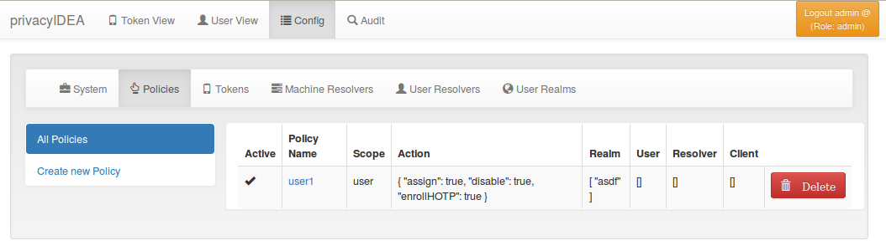

# 8. Policies|策略

Policies can be used to define the reaction and behaviour of the system.

Each policy defines the behaviour in a certain area, called scope. privacyIDEA knows the scopes:

策略可用于定义系统的反应和行为。每个策略定义在某个区域中的行为，称为作用域“Scope”。privacyIDEA有以下作用域：

* [8.1. Admin policies](8.1. Admin policies 管理员策略.html)|管理员策略
* [8.2. User Policies](8.2. User Policies 用户策略.html)|用户策略
* [8.3. Authentication policies](8.3. Authentication policies 认证策略.html)|认证策略
* [8.4. Authorization policies](8.4. Authorization policies 授权策略.html)|授权策略
* [8.5. Enrollment policies](8.5. Enrollment policies 令牌注册策略.html)|令牌注册策略
* [8.6. WebUI Policies](8.6. WebUI Policies Web界面策略.html)|Web界面策略
* [8.7. Audit policies](8.7. Audit policies 审计策略.html)|审计策略
* [8.8. Gettoken policies](8.8. Gettoken policies 获取令牌策略.html)|获取令牌策略
* [8.9. Register Policy](8.9. Register Policy 注册策略.html)|注册策略

You can define as many policies as you wish to. The logic of the policies in the scopes is additive.

您可以定义任意数量的策略。作用域中的策略的逻辑是累加的。

Policy Definition(策略定义)

Starting with privacyIDEA 2.5 you can use policy templates to ease the setup.

从privacyIDEA 2.5开始，您可以使用策略模板来简化设置。

* [8.10. Policy Templates](8.10. Policy Templates 策略模板.html)|策略模板

Each policy can contain the following attributes:

每个策略可以包含以下属性：

**policy name**

A unique name of the policy. The name is the identifier of the policy. If you create a new policy with the same name, the policy is overwritten.

策略的唯一名称。名称是策略的标识符。如果创建具有相同名称的新策略，则策略将被覆盖。

**scope**

The scope of the policy as described above.

上述策略的作用域。

**action**

This is the important part of the policy. Each scope provides its own set of actions. An action describes that something is allowed or that some behaviour is configured. A policy can contain several actions. Actions can be of type boolean, string or integer. Boolean actions are enabled by just adding this action - like scope=user:action=disable, which allows the user to disable his own tokens. string and integer actions require an additional value - like scope=authentication:action='otppin=userstore'.

这是策略的重要部分。每个作用域提供自己的一组动作。动作描述了允许某些内容或配置某些行为。一个策略可以包含多个动作。动作可以是布尔型，字符串或整数型。布尔型动作只需要像这样添加动作：`scope=user:action=disable`（允许用户禁用自己的令牌），字符串和整数动作需要一个附加值，如：`scope=authentication:action='otppin=userstore'`。

**user**

This is the user, for whom this policy is valid. Depending on the scope the user is either an administrator or a normal authenticating user.

If this field is left blank, this policy is valid for all users.

此策略生效的用户。这里的用户是管理员还是正常的认证用户取决于作用域。如果此字段留空，则此策略对所有用户有效。

**resolver**

This policy will be valid for all users in this resolver.

If this field is left blank, this policy is valid for all resolvers.

此策略将对此解析器中的所有用户有效。如果此字段留空，则此策略对所有解析器有效。

**realm**

This is the realm, for which this policy is valid.

If this field is left blank, this policy is valid for all realms.

此策略将对此域有效。如果此字段留空，则此策略对所有域都有效。

**client**

This is the requesting client, for which this action is valid. I.e. you can define different policies if the user access is allowed to manage his tokens from different IP addresses like the internal network or remotely via the firewall.

You can enter several IP addresses or subnets divided by comma (like 10.2.0.0/16, 192.168.0.1).

这是动作有效的请求的客户端。也就是说，可以定义不同的策略来确定是否允许用户从不同的IP地址访问管理其令牌，如内部网络或通过防火墙远程。您可以输入多个IP地址或子网，以逗号分隔（如10.2.0.0/16,192.168.0.1）。

**time**

(added in privacyIDEA 2.12)

In the time field of a policy you can define a list of time ranges. A time range can consist of day of weeks (dow) and of times in 24h format. Possible values are:

（privacyIDEA 2.12加入）在策略的时间字段中，您可以定义时间范围列表。时间范围可以包括星期几（24小时）和24小时格式的时间。可能的值有：

<dow>: <hh>-<hh> <dow>: <hh:mm>-<hh:mm> <dow>-<dow>: <hh:mm>-<hh:mm>

You may use any combination of these. Like:

您可以使用这些的任意组合。如：

Mon-Fri: 8-18

to define certain policies to be active throughout working hours.

以定义某些策略在整个工作时间是活动的。

> Note:
> 
> If the time of a policy does not match, the policy is not found. Thus you can get effects you did not plan. So think at least twice before using time restricted policies.
> 
> 注：
> 
> 如果策略的时间不匹配，则找不到该策略。因此，你可以得到没有时间计划的效果。所以在使用时间限制策略之前至少要考虑两次。（笔者注：估计是说如果要设定时间计划最好需要想到在时间计划内执行的策略和在时间计划外执行的策略）

Example:

> Note:
> 
> Policies can be active or inactive. So be sure to activate a policy to get the desired effect.
> 
> 注：
> 
> 策略可以是活动或非活动的。因此，请务必激活策略以获得所需的效果。