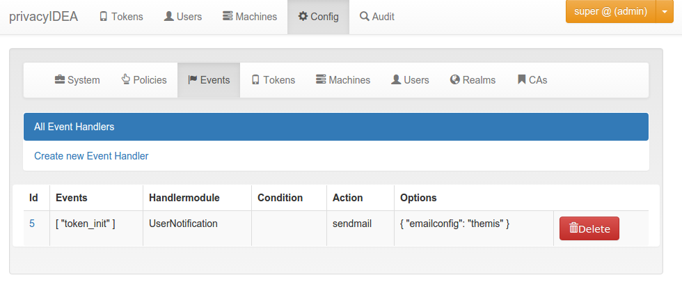

# 9. Event Handler|事件处理器

Added in version 2.12.

What is the difference between Policies and event handlers?

Policies are used to define the behaviour of the system. With policies you can change the way the system reacts.

With event handlers you do not change the way the system reacts. But on certain events you can trigger a new action in addition to the behaviour defined in the policies.

在2.12版本加入。策略和事件处理器之间有什么区别？策略用于定义系统的行为。使用策略，您可以更改系统响应的方式。使用事件处理器，您不会更改系统响应的方式。但在某些事件中，除了策略中定义的行为之外，您还可以触发新的操作。

## 9.1. Events|事件

Each **API call** is an **event** and you can bind arbitrary actions to each event as you like.

每个**API调用**都是一个**事件**，您可以根据需要将任意动作绑定到每个事件。

Internally events are marked by a decorator “event” with an event identifier. At the moment not all events might be tagged. Please drop us a note to tag all further API calls.

内部事件由具有事件标识符的装饰器“event”标记。目前不是所有的事件都可能被标记。

An action is bound to the event token_init.(动作绑定到token_init事件)

## 9.2. Handler Modules and Actions|处理器模块和动作

The actions are defined in handler modules. So you bind a handler module and the action, defined in the handler module, to the events.

动作在处理器模块中定义。因此，您将处理器模块和在处理器模块中定义的动作绑定到事件。

The handler module can define several actions and each action in the handler module can require additional options.

The event sendmail requires the option emailconfig.

## 9.3. Conditions|条件

Added in version 2.14

And event handler module may also contain conditions. Only if all conditions are fullfilled, the action is triggered. Conditions are defined in the class property conditions and checked in the method check_condition. The UserNotification Event Handler defines such conditions.

### 9.3.1. Available Handler Modules|可用的处理器模块

* [9.3.1.1. User Notification Handler Module](9.3.1.1. User Notification Handler Module 用户通知处理程序模块.md)

