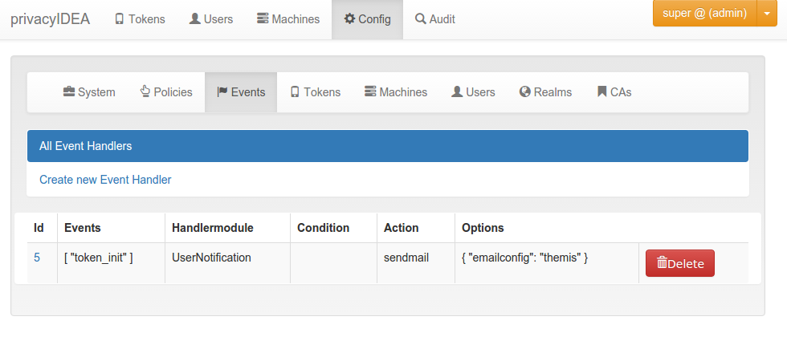
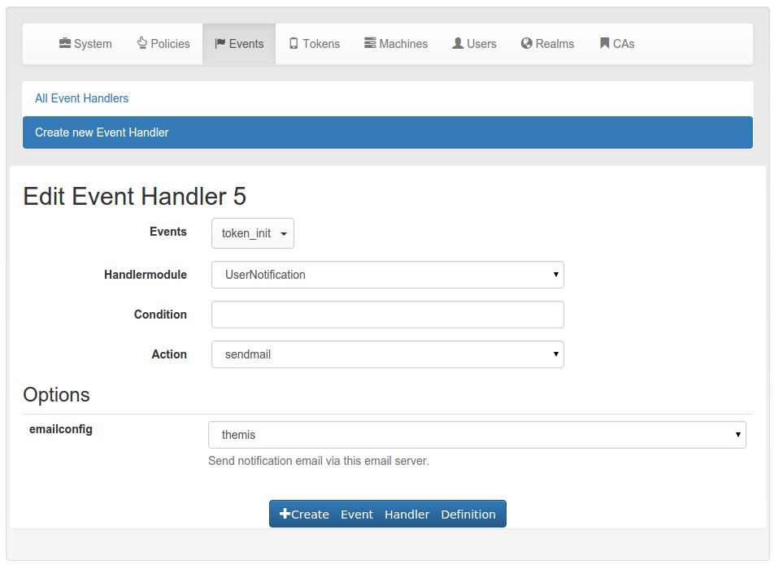

# 9. Event Handler|事件处理程序

Added in version 2.12.

What is the difference between Policies and event handlers?

Policies are used to define the behaviour of the system. With policies you can change the way the system reacts.

With event handlers you do not change the way the system reacts. But on certain events you can trigger a new action in addition to the behaviour defined in the policies.

## 9.1. Events|事件

Each **API call** is an **event** and you can bind arbitrary actions to each event as you like.

Internally events are marked by a decorator “event” with an event identifier. At the moment not all events might be tagged. Please drop us a note to tag all further API calls.

An action is bound to the event token_init.

## 9.2. Handler Modules and Actions|处理程序模块和操作

The actions are defined in handler modules. So you bind a handler module and the action, defined in the handler module, to the events.

The handler module can define several actions and each action in the handler module can require additional options.

The event sendmail requires the option emailconfig.

## 9.3. Conditions|条件

Added in version 2.14

And event handler module may also contain conditions. Only if all conditions are fullfilled, the action is triggered. Conditions are defined in the class property conditions and checked in the method check_condition. The UserNotification Event Handler defines such conditions.

### 9.3.1. Available Handler Modules

#### 9.3.1.1. User Notification Handler Module

The user notification handler module is used to send emails token owners or administrators in case of any event.

##### 9.3.1.1.1. Possible Actions

###### 9.3.1.1.1.1. sendmail

The sendmail action sends an email to the tokenowner user. The email is sent, if an administrator managed the users token.

**emailconfig**

* required Option
* The email is sent via this SMTP server configuration.

**subject**

* optional

The subject line of the mail that is sent.

###### 9.3.1.1.1.2. sendsms

The sendsms action sends an SMS to the tokenowner. The SMS is sent, if an administrator managed the users token.

**smsconfig**

* required Option
* The SMS Gateway configuration.

##### 9.3.1.1.2. Options for both actions

Both actions **sendmail** and **sendsms** take several common options.

**body**

* optional

Here the administartor can specify the body of the email, that is sent. The body may contain the following tags

* {admin} name of the logged in user.
* {realm} realm of the logged in user.
* {action} the action that the logged in user performed.
* {serial} the serial number of the token.
* {url} the URL of the privacyIDEA system.
* {user} the given name of the token owner.
* {givenname} the given name of the token owner.
* {surname} the surname of the token owner.
* {username} the loginname of the token owner.
* {userrealm} the realm of the token owner.
* {tokentyp} the type of the token.
* {registrationcode} the registration code in the detail response.
* {recipient_givenname} the given name of the recipient.
* {recipient_surname} the surname of the recipient.

**To**

* required

This specifies to which type of user the notification should be sent. Possible recipient types are:

* token owner,
* logged in user,
* admin realm,
* internal admin,
* email address.

Depending on the recipient type you can enter additional information. The recipient type email takes a comma separated list of email addresses.

##### 9.3.1.1.3. Code

This is the event handler module for user notifications. It can be bound to each event and can perform the action:

* sendmail: Send an email to the user/token owner
* sendsms: We can also notify the user with an SMS.

The module is tested in tests/test_lib_events.py

class privacyidea.lib.eventhandler.usernotification.**NOTIFY_TYPE**  [source]

Allowed token owner

**ADMIN_REALM** = 'admin realm'

**EMAIL** = 'email'

**INTERNAL_ADMIN** = 'internal admin'

**LOGGED_IN_USER** = 'logged_in_user'

**TOKENOWNER** = 'tokenowner'

class privacyidea.lib.eventhandler.usernotification.UserNotificationEventHandler  [source]

An Eventhandler needs to return a list of actions, which it can handle.

It also returns a list of allowed action and conditions

It returns an identifier, which can be used in the eventhandlig definitions

**actions**

This method returns a dictionary of allowed actions and possible options in this handler module.

Returns:	dict with actions

**check_condition**(options)  [source]

Check if all conditions are met and if the action should be executed. The the conditions are met, we return “True” :return: True

**conditions**

The UserNotification can filter for conditions like * type of logged in user and * successful or failed value.success

allowed types are str, multi, text, regexp

Returns:	dict

description = 'This eventhandler notifies the user about actions on his tokens'

**do**(action, options=None)  [source]

This method executes the defined action in the given event.

Parameters:
* action –
* options (dict) – Contains the flask parameters g, request,response and the handler_def configuration

Returns:

identifier = 'UserNotification'